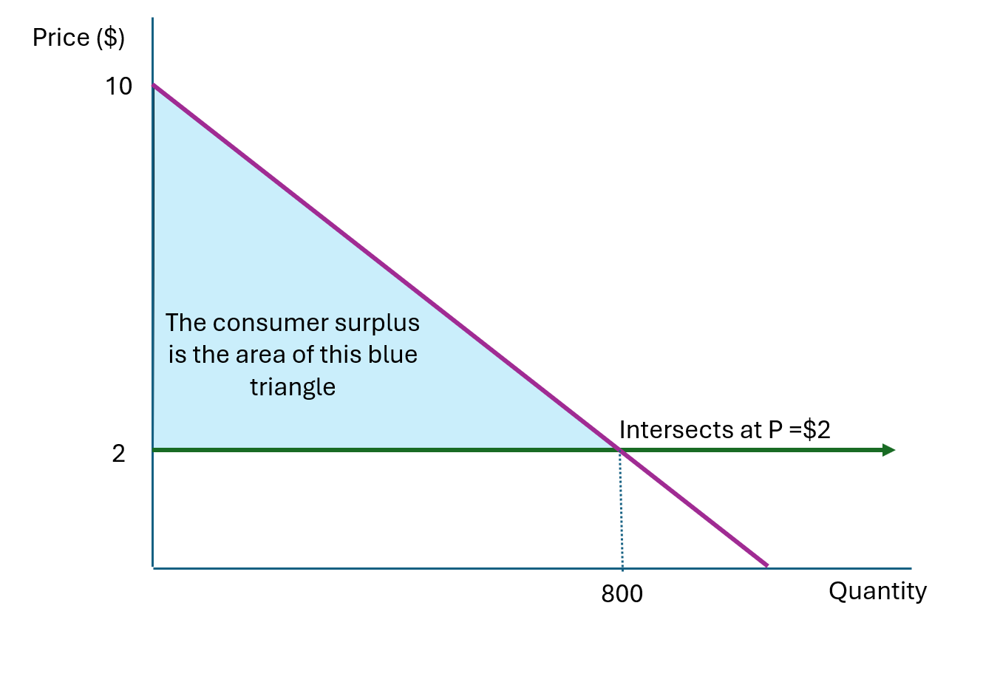
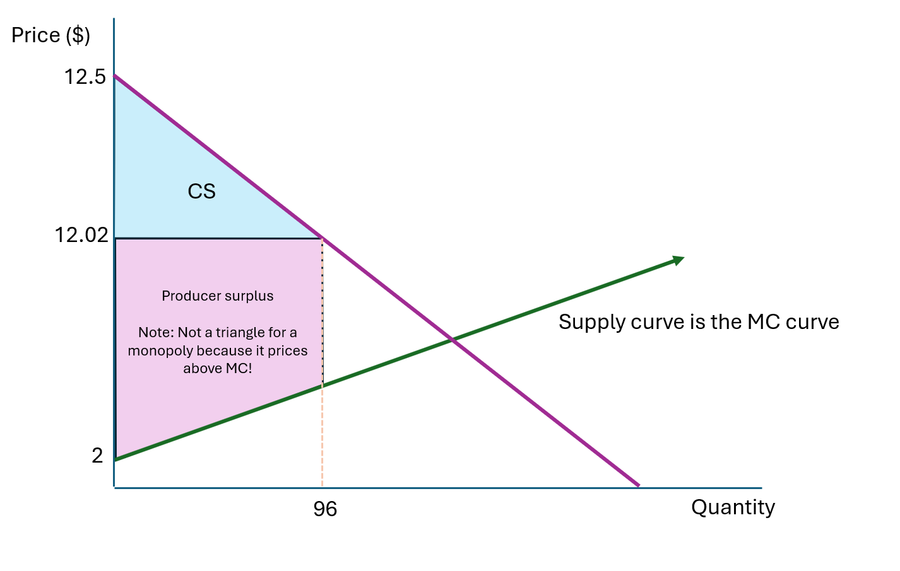

# Question 1

**Question 1 (a):** Describe in words the trade-off monopolists make when setting prices to maximize profits. 

The monopolist faces a trade-off between charging higher prices, which increases profits for the goods it **does** sell; but raising prices also drives some customers away, meaning the monopolists lose profit from these lost sales. The monopolist needs to trade-off these two factors when raising its prices. 

Example: Suppose you run a concert venue. If you charge $200 per ticket, you make a lot per ticket but many seats stay empty. If you charge $20 per ticket, you fill the venue but make little per person. The monopolist has to find the sweet spot where the combination of price and quantity sold maximizes total profit.

\vspace{12pt}

**Question 1 (b):** Describe in words how monopolists use this trade-off to find the optimal price to maximize profits.

Monopolists find the optimal price by continuing to raise prices as long as the extra profit gained from higher prices exceeds the profit lost from fewer sales. This is also equivalent to the marginal revenue from raising prices is equal to the marginal cost of raising prices. These are two equivalent ways of showing this trade-off.

\vspace{12pt}

**Question 1 (c):** Describe in words why monopoly power makes society worse off compared to a competitive market.

Monopolies harm society because they produce less output and charge higher prices than competitive markets. This prevents some mutually beneficial trades from occuring - that is, some customers who have willingness-to-pay above the marginal cost of production are priced out of the market. We call the value of this loss to society the deadweight loss.

\vspace{12pt}

# Question 2

There is a strong demand for boba tea in Davis - let demand be represented by $Q_{D} = 1,000 - 100 P$.

Boba tea is relatively cheap to make, assume there is a constant marginal cost of making boba tea of \$2. This means the total cost of supplying boba tea is $TC = 2Q_{S}$.

**Question 2 (a):** By my count, there are 14 boba tea stores in downtown Davis, more than enough to assume that the market for boba tea works perfectly competitively. Find the quantity of tea that will be bought/sold; the price for which it sells; consumer surplus and producer suruplus.

Under competitive markets, the price will equal the marginal cost. Here we have that the $P = MC = \$2$.

Plugging this into demand, we have that $Q_{D} = 1,000 - 100 \times 2 = 800$ boba teas will be sold.

Cosumer surplus is found as the area between the demand curve and the price - this shows, for each customer the difference between their willingness to pay and the price they actually pay. This is how much each customer is better off. The total consumer surplus is over all customers.

There are two equivalent ways of finding the consumer surplus. Both are fine for the exam. 

For both approaches, it is convenient to convert the demand function into terms of price. This is called the inverse demand function. This aligns price as the left-hand-side variable, corresponding to having price on the y-axis of our charts.

Here, the inverse demand function $P = 10 - \frac{1}{100}Q_{D}$. Here, the price variable represents the customer's willingness to pay. That is, the price they would pay for some given level of demand.

First, because demand is lienar, we can find the area of the triangle using geometry:

So the consumer surplus is:
\begin{equation*}\begin{aligned}
    CS &= \frac{1}{2} \times \text{Base} \times \text{Height}\\
    &= \frac{1}{2} 800 \times (10 - 2)\\
    & = \$39,200
\end{aligned}\end{equation*}

Second, we can also use integration to find the same area:
\begin{equation*}\begin{aligned}
    CS &= \int_{0}^{800} \left[(10 - \frac{1}{100}Q) - 2\right]\\
    &=\left[10Q - \frac{1}{200}Q^{2} - 2Q\right]_{0}^{800}\\
    &= 8,000 - \frac{1}{200} \times 640,000 - 1,600\\
    &= \$3,200
\end{aligned}\end{equation*}

Generally, the producer surplus is the producer surplus is the profit that the firms make, which we we could find as the area between the price and the supply curve. In this case, because marginal cost is constant, profits and producer surplus is \$0.

\vspace{12pt}

**Question 2 (b):** Uh oh, Davis health inspectors have shutdown all but one boba tea store, which now operates as a monopoly. Setup the optimization function of the last remaining tea shop.

The goal of the monopolist is to maximize profits by setting the price using its market power.

The profit function for the tea shop is:
\begin{equation*}\begin{aligned}
    \pi &= P \times Q(P) - TC(Q)\\
    &=P (1,000 - 100P) - 2 \times (1,000 - 100P)
\end{aligned}\end{equation*}
Notice how we substituted the demand quantity in for $Q$ in the total cost function.

The optimization function is then:
\begin{equation*}\begin{aligned}
    \max_{P} \pi = \max_{P} P (1,000 - 100P) - 2 \times (1,000 - 100P)
\end{aligned}\end{equation*}

\vspace{12pt}

**Question 2 (c):** Find the quantity of tea that will be bought/sold from the monopoly; the price for which it sells; consumer surplus and producer suruplus. 

To find the maximimum of the profit function, we find when its derivative is zero. Whatever price makes the derivative zero maximizes profits.

\begin{equation*}\begin{aligned}
    \frac{\partial \pi}{\partial P} = (1,000 - 100P) + P(-100) + 200 &= 0 
    1,200 - 200P = 0\\
    P = \$6\\
\end{aligned}\end{equation*}

So under the monopolist, the price will be raised to \$6, a massive markup over the \$2 in a competitive market.

Under the monopolist, they will sell $Q_{D} = 1,000 - 100 \times 6 = 400$ teas.

The consumer surplus should be reduced, and we will calculate it using the triangle formula:
\begin{equation*}\begin{aligned}
    CS &= \frac{1}{2} \times 400 \times (10 - 6)\\
    &= 800\\
\end{aligned}\end{equation*}

The producer surplus is the same as the monopolist's profit:
\begin{equation*}\begin{aligned}
    PS = \pi &= P (1,000 - 100P) - 2 \times (1,000 - 100P)\\
    &= 6 \times (1,000 - 600) - 2 \times (1,000 - 600)\\
    &= 1,600\\
\end{aligned}\end{equation*}

\vspace{12pt}

**Question 2 (d):** How much worse off is Davis from having the boba tea market run as a monopoly, rather than perfectly competitively?

Under the competitive market, the total social surplus was $CS + PS = 3,200 + 0 = \$3,200$. 

Under the monopolist, the total social surplus was $CS + PS = 800 + 1,600 = \$2,400$. 

So the monopolist reduced social welfare by \$800, but increased its profits to \$1,600, a rational chocie for the tea maker.

The loss in social welfare of \$800 is called deadweight loss. It shows that customers have \$800 that they would like to spend on tea, but have been blocked from the market from the monopolist raising prices. This is a problem for society, the tea shop did not make more money by selling more or better tea, but by reducing economic activity and making customers worse off. 

\newpage

# Extra practice questions

# Question A

In Question 2 above, under perfect competition, the producer surplus is zero because: 1) marginal costs are constant; and 2) everyone sells at marginal cost.

In this question, we will see a problem where marginal costs are increasing. This makes the math of calculate producer surplus slightly harder, but does not fundamentally change how we approach the question.

Let the total cost of supplying boba tea be $TC = 2Q_{S} + 0.05Q_{S} ^{2}$. Let total demand be  $Q_{D} = 2,500 - 200 P$

**Question A (a):** Assuming perfect competition, find the quantity of tea that will be bought/sold; the price for which it sells; consumer surplus and producer suruplus.

First, we find the marginal cost by taking the derivative of total cost:
\begin{equation*}\begin{aligned}
    MC = \frac{d(TC)}{dQ} = 2 + 0.1Q    
\end{aligned}\end{equation*}

It is convenient to convert the demand function into terms of price. The inverse demand function is: $P = 12.5 - \frac{1}{200}Q_{D}$

Under competitive markets, the price will equal the marginal cost. Here we have that $P = MC$:
\begin{equation*}\begin{aligned}
    P &= MC\\
    12.5 - \frac{1}{200}Q &= 2 + 0.1Q\\
    10.5 &= \frac{21}{200} Q\\
    Q &= 100\\
\end{aligned}\end{equation*}
So 100 will be sold. Note here, we used a condition that price equals marginal cost to find the quantity, rather than the price. 

The price will be: $P = 12.5 - \frac{1}{200} \times 100 = \$12$. Ok, that's probably too high for boba tea - this must be really good tea!

The consumer surplus is:
\begin{equation*}\begin{aligned}
    CS &= \frac{1}{2} \times 100 \times (12.5 - 12)\\
    &= \$25\\
\end{aligned}\end{equation*}

The producer surplus is:
\begin{equation*}\begin{aligned}
    PS &= P \times Q - TC(Q)\\
    &= 12 \times 100 - (2 \times 100 + 0.05 \times 100^{2})\\
    &=  \$500\\
\end{aligned}\end{equation*}

**Question A (b):** Assuming one firm operates as a monopoly, find the quantity of tea that will be bought/sold; the price for which it sells; consumer surplus and producer suruplus.

The monopolist's profit function is:
\begin{equation*}\begin{aligned}
    \pi &= P \times (2,500 - 200 P) - 2Q + 0.05Q ^{2}\\
    &=P \times (2,500 - 200 P) - 2 (2,500 - 200 P) + 0.05(2,500 - 200 P)^{2}\\
\end{aligned}\end{equation*}

The monopolist maximizes profits by choosing the price to sell at with its marginal cost:
\begin{equation*}\begin{aligned}
    \max_{P} \pi = &\max_{P} P \times (2,500 - 200 P) - 2 (2,500 - 200 P) + 0.05(2,500 - 200 P)^{2}\\
\end{aligned}\end{equation*}

To do this, we find the highest point of the profit function, finding where the derivative of the profit function is zero.

\begin{equation*}\begin{aligned}
    \frac{\partial \pi}{\partial P} =  &(2,500 - 200 P) + P \times (- 200) + 2 \times 200 + 0.05 \times 2 \times -200 \times (2,500 - 200 P)=0\\
    &(2,500 - 200 P) + P \times (- 200) + 2 \times 200 + 0.05 \times 2 \times -200 \times (2,500 - 200 P)=0\\
    &2,900 -400P + 50,000 - 4,000P = 0\\
    &4,400P = 52,900\\
    &P = 12.02\\
\end{aligned}\end{equation*}

So demand is $Q_{D} = 2,500 - 200 P = 2,500 - 200 * 12.02 = 96$.

We can calculate consumer surplus as we have been doing above:
\begin{equation*}\begin{aligned}
    CS &= \frac{1}{2} \times 96 \times (12.5 - 12.02)\\
    &=23.04\\
\end{aligned}\end{equation*}

But note that we need to calculate producer surplus a little bit differently, because the monopolist is pricing with a markup above marginal cost, we can't use the triangle formula. You can find the producer surplus area using geometry rules for a quadrilateral, but I like to just use the profit function (gives the same thing!).

\begin{equation*}\begin{aligned}
    PS = \pi &= 12.02 \times 96 - 2 \times 96 - 0.05 \times 96^{2}\\
    &= \$501.12\\
\end{aligned}\end{equation*}

**Question A (c):** How much worse off is Davis from having the boba tea market run as a monopoly, rather than perfectly competitively?

In the competitive market, total surplus was $CS + PS =  25 + 500 = 525$.

Under the monopolist, it decreased to $CS + PS = 23.04 + 501.12 = 524.16$ - a deadweight loss of 0.84, a pretty small decrease!

 