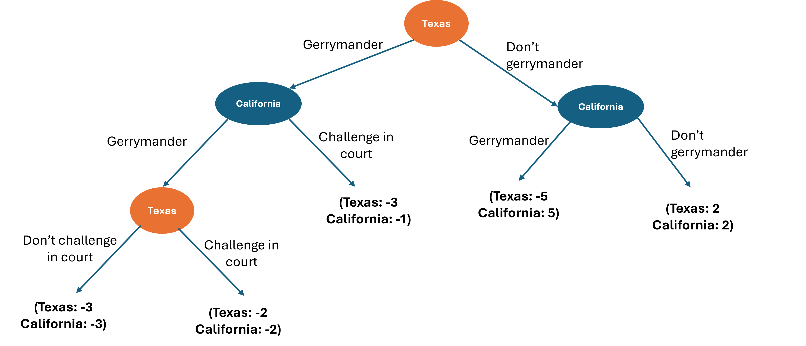

Name:__________________________________________

# Question 1

In soccer penalty kicks, the kicker has to choose the direction that they will kick, and the goalie will choose the direction that they will dive. They will choose at the same time.

A goalie values a save as much as the kicker values a goal. The goalie is stronger on the left side and is more likely to make a save in that direction. The kicker is stronger on the right side and is more likely to score in that direction.

This gives us the following payoff matrix, where the decimal numbers represent the probability that they will score/make the save, versus miss.

\renewcommand{\arraystretch}{3}
\begin{table}[htbp]
\begin{tabular}{llll}
                      &                                  & \multicolumn{2}{l}{\textbf{Kicker}}                                                         \\
                      & \multicolumn{1}{l|}{}            & \multicolumn{1}{l|}{Left}                  & Right                          \\\cline{2-4} 
\multirow{2}{*}{\textbf{Goalie}} & \multicolumn{1}{l|}{Left} & \multicolumn{1}{l|}{K: 0.2, G: 0.7}   & K: 0.8, G: 0 \\ \cline{2-4} 
                      & \multicolumn{1}{l|}{Right}         & \multicolumn{1}{l|}{K: 0.6, G: 0} & K: 0.1, G: 0.6 \\ \cline{2-4} 
\end{tabular}
\end{table}

**Question 1 (a):** Find the mixed strategy (with randomization) Nash Equilibrium. (9 points)

\begin{mybox}

There are two economic conditions that must both occur to have a Nash Equilibrium:
\begin{itemize}
    \item $E(\pi_{K}|\text{Kicker goes left} ) = E(\pi_{K}|\text{Kicker goes right} )$ (1 point)
    \item $E(\pi_{G}|\text{Goalie goes left} ) = E(\pi_{G}|\text{Goalie goes right} )$ (1 point)
\end{itemize}

(Still 2 points if answers do not say these conditions explicitly, ie, just automatically introduce them into their working)

Assigning probabilities: Probability the kicker goes left as $p_{K}$; Probabilty the goalie goes left as $p_{G}$ (1 point) (Still 1 point if answers do not say this explicitly, ie, just automatically introduce this into their equations)

\textbf{Solving for } $p_{G}$:

(1 point) for:
\begin{equation*}\begin{aligned}
    E(\pi_{K}|\text{Kicker goes left} ) &= p_{G} \times 0.2 + (1- p_{G}) \times 0.6\\
    &=0.6 - 0.4p_{G}
\end{aligned}\end{equation*}

(1 point) for:
\begin{equation*}\begin{aligned}
    E(\pi_{K}|\text{Kicker goes right} ) &= p_{G} \times 0.8 + (1- p_{G}) \times 0.1\\
    &=0.1 + 0.7p_{G}\\
\end{aligned}\end{equation*}

(1 point for):
\begin{equation*}\begin{aligned}
    &0.6 - 0.4p_{G} = 0.1 + 0.7p_{G}\\
    &1.1p_{G} = 0.5\\
    &p_{G} = \frac{5}{11}=0.45...\\
\end{aligned}\end{equation*}

\textbf{Solving for } $p_{K}$:

(1 point) for:
\begin{equation*}\begin{aligned}
    E(\pi_{G}|\text{Goalie goes left} ) &= p_{K} \times 0.7 + (1- p_{K}) \times 0\\
    &=0.7p_{G}
\end{aligned}\end{equation*}

(1 point) for:
\begin{equation*}\begin{aligned}
    E(\pi_{G}|\text{Goalie goes right} ) &= p_{K} \times 0 + (1- p_{K}) \times 0.6\\
    &=0.6 - 0.6p_{K}
\end{aligned}\end{equation*}

(1 point for):
\begin{equation*}\begin{aligned}
    &0.7p_{K} = 0.6 - 0.6p_{K}\\
    &1.3p_{K} = 0.6\\
    &p_{K} = \frac{6}{13} = 0.46...\\
\end{aligned}\end{equation*}
\end{mybox}

\begin{mybox}

The mixed strategy Nash equilibrium is: (1 point)
\begin{itemize}
    \item For the Kicker:
    \begin{itemize}
        \item Going left with $\frac{5}{11}$ probability
                \item Going right with $\frac{6}{11}$ probability
    \end{itemize}
        \item For the Goalie:
    \begin{itemize}
        \item Going left with $\frac{6}{13}$ probability
                \item Going right with $\frac{7}{13}$ probability
    \end{itemize}
\end{itemize}

No particular way to write out the mixed strategy NE, but it must have all the strategies for each player and the probabilities assigned to them.

Marking guide:
\begin{itemize}
    \item If the student gets the correct final answer but misses intermediate steps, full marks should still be given
    \item If the student mixes up the choice probabilities for the kicker and goalie (ie, that the expected payoffs for the kicker shows the kicker's choice probabilities), but otherwise has correct working, a maximum of 6 points for the total question is possible
    \item If some of the intermediate steps are implicit in their answer, part marks for them should be given if its obvious of what they were trying to show
    \item Half points off for each trivial math errors - eg, dropping a minus sign, etc
\end{itemize}

\end{mybox}

# Question 2

India is currently facing a choice about whether to align its trading relationship with China or the USA. Simultaneously, the USA has the choice whether to impose high tariffs on India or not.

The following payoff matrix shows the changes to each country's GDP as the result of these choices (each country prefers higher GDP).

\renewcommand{\arraystretch}{3}
\begin{table}[htbp]
\begin{tabular}{llll}
                      &                                  & \multicolumn{2}{l}{\textbf{India}}                                                         \\
                      & \multicolumn{1}{l|}{}            & \multicolumn{1}{l|}{Align with USA}                  & Align with China                          \\\cline{2-4} 
\multirow{2}{*}{\textbf{USA}} & \multicolumn{1}{l|}{Impose tariffs} & \multicolumn{1}{l|}{India: -6, USA: 8}   & India: -4, USA: 2 \\ \cline{2-4} 
                      & \multicolumn{1}{l|}{Don't impose tariffs}         & \multicolumn{1}{l|}{India: 5, USA: 3} & A: India: 4, USA: -3 \\ \cline{2-4} 
\end{tabular}
\end{table}

\vspace{12pt}

\begin{mybox}

The solved payoff matrix should look like:

\includegraphics{images/final_tariff_best_responses.png}

\end{mybox}

\vspace{12pt}

**Question 2 (a):**  What are India's best responses to the USA's actions? (2 points)

\begin{mybox}

India's best response is:
\begin{itemize}
    \item Align with China if USA imposes tariffs (1 point)
    \item Align with USA if USA does not impose tariffs (1 point)
\end{itemize}

No particular way that students need to write their answer, it can be in words or as a mathematical function. As long as it conveys India's  best action for \textbf{both} of USA's actions, full marks should be given.

\end{mybox}

**Question 2 (b):** Does either player have a dominating strategy? If so, what are they? (2 points)

\begin{mybox}

Yes, USA has a dominating strategy to always impose tariffs. (2 points)

Part mark attributtion:
\begin{itemize}
    \item If the student answers yes but doesn't say what they are, 0.5 points maximum only
    \item If the student gives the wrong answer, \textbf{but} their answer is consistent with how they've solved the game payoff matrix, give 1 points. For example, if it is obvious with arrows on the payoff matrix or written explanation that they think India has a dominating strategy, or USA does not have a dominating strategy, and their answer is consistent with that, then 1 marks should be given.
    \item If they give the incorrect answer and it is not obvious what their solution to the payoff matrix with arrows/etc is, 0 points.
    \item If they give no answer here, 0 points, even if they solve the payoff matrix correctly.
\end{itemize}

\end{mybox}

**Question 2 (c):** Find all pure strategy (no randomization) Nash Equilibria. You can solve this in the payoff matrix, but make sure you write your final answer for the Nash Equilibria here. (2 points)

\begin{mybox}

The Nash Equilibrium strategy is that the USA imposes tariffs, and India aligns with China. (2 points)

No particular way that students need to write their answer - can be written or in more mathematical formatting.

Part mark attributtion:
\begin{itemize}
    \item If the student gives the wrong answer, \textbf{but} it is obvious that they have solved the payoff matrix correctly with arrows/written justification, give 1.5 points. 
    \item If the student gives the wrong answer, \textbf{and} their answer is consistent with how they've solved the game payoff matrix (incorrectly), give 1 points. 
    \item If they give the incorrect answer and it is not obvious what their solution to the payoff matrix with arrows/etc is, 0 points.
    \item If they give no answer here, 0 points, even if they solve the payoff matrix correctrly.
\end{itemize}

\end{mybox}

# Question 3

The state governments for Texas and California are both proposing to gerrymander their electoral districts to increase their respective seats in the USA House of Representatives. Texas will pass their laws first. California can then decide to gerrymander or not. If Texas gerrymanders first, the choice to gerrymander can be challenged in the Supreme Court, which would overturn all gerrymander actions and cost a lot of money.

The below game tree shows the sequence and payoffs of this sequential/extensive form game.

**Question 3 (a):** Find the equilibrium outcome (strategies and payoffs) if Texas and California make their decisions optimally. You can solve this in the game tree, but make sure you write your final answer here. (5 points) 

\begin{mybox}

The solved game tree should look like:

\includegraphics{images/final_gerrymander_tree_solved.png}

The equilibrium outcome is that Texas would Gerrymander and California would challenge it in court. Texas would get a payoff of -3, and California would get a payoff of -1.

Marking guide
\begin{itemize}
    \item Full marks if they correctly write down the outcome in terms of strategies and payoffs.
    \item One point off if they don't include the payoffs.
    \item If their answer is incorect, give one point for each correct subgame on the game tree to a max of 4 points. Only if the solution on the game tree is obvious.
    \item If their answer is incorrect, and it is not clear/obvious what they have answered on the game tree, give 0 points 
\end{itemize}

\end{mybox}

**Question 3 (b):** Write the subgame perfect Nash Equilibrium solution to this game, that is, the optimal strategy at each decision node. (4 points)

\begin{mybox}

The subgame perfect Nash Equilibrium is:
\begin{equation*}\begin{aligned}
    \left( \left( \underbrace{\text{Gerrymander}, \text{Challenge}}_{\text{Texas}} \right), \left( \underbrace{\text{Challenge}, \text{Gerrymander}}_{\text{California}} \right) \right)
\end{aligned}\end{equation*}

Full marks if they write the optimal strategy at each decision node. Can be in any format - ie, more written/dot points rather than in brackets.

For part marks: 1 point for each correct subgame decision.

\end{mybox}

\newpage

# Question 4

Apple and Google are battling it out in the smartphone market. Their phone offerings are quite different, so they compete in different market segments from one another.

Apple's inverse demand and total cost curve is:
\begin{equation*}\begin{aligned}
    &P_{A} = 1,800 - 0.15q_{A} - 0.2q_{G}\\
    &TC_{A} = 75q_{A}\\
\end{aligned}\end{equation*}

Google's inverse demand and total cost curve is:
\begin{equation*}\begin{aligned}
    &P_{G} = 1,200 - 0.12q_{A} - 0.1q_{G}\\
    &TC_{G} = 70q_{G}\\
\end{aligned}\end{equation*}

\vspace{12pt}

**Question 4 (a):** If Apple and Google compete in a Cournot game with differentiated products (choosing quantities), find Apple and Google's best response functions. (7 points)

\begin{mybox}

\textbf{Apple:}

Apple's profit function is (1 point):
\begin{equation*}\begin{aligned}
    \pi_{A} = \left( 1,800 - 0.15q_{A} - 0.2q_{G} \right)q_{A} - 75q_{A}
\end{aligned}\end{equation*}

The best response function is found by maximising profit with respect to its output. The condition is: (1 point)
\begin{equation*}\begin{aligned}
    \frac{d\pi_{A}}{dq_{A}} = 0
\end{aligned}\end{equation*}

Solving for the best response yields (1.5 point): 
\begin{equation*}\begin{aligned}
    1,725 - 0.2q_{G} - 0.3q_{A} = 0\\
    q_{A}^{*} = BR_{A} = 5,750 - \frac{2}{3}q_{G}\\
\end{aligned}\end{equation*}

\textbf{Google:}

Google's profit function is (1 point):
\begin{equation*}\begin{aligned}
    \pi_{G} = \left( 1,200 - 0.12q_{A} - 0.1q_{G} \right)q_{G} - 70q_{G}
\end{aligned}\end{equation*}

The best response function is found by maximising profit with respect to its output. The condition is: (1 point)
\begin{equation*}\begin{aligned}
    \frac{d\pi_{G}}{dq_{G}} = 0
\end{aligned}\end{equation*}

Solving for the best response yields (1.5 point): 
\begin{equation*}\begin{aligned}
    1,130 - 0.12q_{A} - 0.2q_{G} = 0\\
    q_{G}^{*} = BR_{G} = 5,650 - 0.6q_{A}\\
\end{aligned}\end{equation*}

Marking guide:
\begin{itemize}
    \item Answers do not require any explanation/justification above and beyond the math
    \item If students get the correct best response functions without showing all intermediate steps, full marks should be awarded
    \item If the intermediate steps/conditions are performed automatically/implicitly in their working, marks for them should be awarded
    \item Half marks off for each trivial math error
    \item 1 point off if they use the wrong market's price, eg, 1 point off for using Apple's inverse demand for Google's profit or vice versa
\end{itemize}

\end{mybox}

**Question 4 (b):** Using your answer from part (a), find the price and quantity sold in both Apple and Google's market segments. (5 points)

\begin{mybox}

    We can find Apple's output as intersection between Apple and Google's best response functions, by:
    \begin{equation*}\begin{aligned}
        q_{A}  = 5,750 - \frac{2}{3} \left( 5,650 - 0.6q_{A} \right)\\
        q_{A} = 5750 - 3,766.67 + 0.4q_{A} \quad \text{(1 point)}\\
        0.6q_{A} = 1,983.33\\
        q_{A} = 3,305.55 \quad \text{(1 point)}\\
    \end{aligned}\end{equation*}

    Marking guide:
    \begin{itemize}
        \item Half points off for trivial math errors
        \item No points off due to errors from rounding
        \item Obviously they can find Google's output first with this method for the same points distribution
        \item No explanation is required for full marks for this part
    \end{itemize}

    We can find Google's output with their best response function: (1 point)
    \begin{equation*}\begin{aligned}
        q_{G} &= 5,650 - 0.6 \times 3,305.55\\
        &=3,666.67
    \end{aligned}\end{equation*}

    The price in Apple's market is: (1 point)
    \begin{equation*}\begin{aligned}
        P_{A} &= 1,800 - 0.15 \times 3,305.55 - 0.2\times 3,666.67\\
        &=570.83\\
    \end{aligned}\end{equation*}

    The price in Google's market is: (1 point)
    \begin{equation*}\begin{aligned}
        P_{G} &= 1,200 - 0.12 \times 3,305.55 - 0.1 \times 3,666.67\\
        &=436.67\\
    \end{aligned}\end{equation*}

\end{mybox}

**Question 4 (c):** If Google exits the smartphone game (so $q_{G} = 0$), find the price and quantity sold in Apple's market segment.  (3 points)

\begin{mybox}

Using the best response function we found in part (a), we have: (1.5 points)
\begin{equation*}\begin{aligned}
    q_{A} = 5,750 - \frac{2}{3} \times 0 = 5,750\\
\end{aligned}\end{equation*}

So the price is: (1.5 points)
\begin{equation*}\begin{aligned}
    P_{A} &= 1,800 - 0.15 \times 5,750 - 0.2 \times 0\\
    &=\$937.5\\
\end{aligned}\end{equation*}

Marking guide:
\begin{itemize}
    \item Answers may solve this from scratch using the monopoly MR = MC formulas. If they get the correct final answer, full marks should be given. If they do not get the correct final answer, part marks should be given up to a maximum of 2 points.
    \item If answers do not use $q_{G} = 0$ in the quantity or price formulae, then 1 point off for each time this occurs.
    \item Half points off for each minor math mistakes
\end{itemize}

\end{mybox}

**Question 4 (d):** Following part (c), find the consumer surplus in Apple's market segment when Google has exited the market. (3 points)

\begin{mybox}

The consumer surplus is: (3 points)
\begin{equation*}\begin{aligned}
    CS &= \frac{1}{2} \times q_{A} \times (1,800 - P_{A})\\
    &=\frac{1}{2} \times 5,750 \times (1,800 - 937.5)\\
    &=\$2,479,688\\
\end{aligned}\end{equation*}

Marking guide:
\begin{itemize}
    \item If the choke price (1,800) is not correct because $q_{G} \neq 0$, then subtract 1 point
    \item Half points off for each minor math mistakes
\end{itemize}

\end{mybox}

# Question 5

SpaceX is already doing rocket launches for the USA Government. Amazon is about to enter this market. 

The inverse demand for rocket launches is: $P = 1,250 - 2Q$.

The cost curves for both SpaceX and Amazon are:
\begin{itemize}
    \item For SpaceX: $TC_{S} = 25q_{S}$
    \item For Amazon: $TC_{A} = 30q_{A}$
\end{itemize}

**Question 5 (a):** If Amazon enters the market, they will compete with SpaceX in a Stackelberg game with SpaceX being the first mover (choosing quantities, with SpaceX going first). Find the resulting profits for each firm. (11 points)

\begin{mybox}

\textbf{Step 1}

We first find Amazon's best response function. First, Amazon's profit function is: (1 point)
\begin{equation*}\begin{aligned}
    \pi_{A} = (1,250 - 2(q_{A} + q_{S}))q_{A} - 30q_{A} 
\end{aligned}\end{equation*}

The profit maximising condition is: (1 point)
\begin{equation*}\begin{aligned}
    \frac{d\pi_{A}}{dq_{A}} = 0\\
\end{aligned}\end{equation*}

Solving for Amazon's best response function: (2 points)
\begin{equation*}\begin{aligned}
    1,250 - 4q_{A} - 2q_{S} - 30 = 0\\
    q_{A} = 305 - \frac{1}{2}q_{S}\\
\end{aligned}\end{equation*}

Marking guide for this step:
\begin{itemize}
    \item Answers do not require any explanation/justification above and beyond the math
    \item If students get the correct best response function without showing all intermediate steps, full marks should be awarded
    \item If the intermediate steps/conditions are performed automatically/implicitly in their working, marks for them should be awarded
    \item Half marks off for each trivial math error
    \item 1 point off for errors that show a lack of economic understanding - eg, not using $Q = q_{A} + q_{S}$.
\end{itemize}

\textbf{Step 2}

We then find SpaceX's profit: (2 points)
\begin{equation*}\begin{aligned}
    \pi_{S} &= \left(1,250 - 2\left( \left( 305 - \frac{1}{2}q_{S} \right) + q_{S}\right)\right)q_{S} - 25q_{S}\\
    &=1,250q_{S} - 610q_{S} + q_{S}^{2} -2 q_{S}^{2} - 25q_{S}\\
    &=615q_{S} - q_{S}^{2}\\
\end{aligned}\end{equation*}

SpaceX is going to maximise profits, with condition: (1 point)
\begin{equation*}\begin{aligned}
    \frac{d\pi_{S}}{dq_{S}} = 0\\
\end{aligned}\end{equation*}

Solving this yields: (1 point)
\begin{equation*}\begin{aligned}
    &615 - 2q_{S} = 0\\
    &q_{S} = 307.5\\
\end{aligned}\end{equation*}

\end{mybox}

\begin{mybox}

Marking guide for this step:
\begin{itemize}
    \item Answers do not require any explanation/justification above and beyond the math
    \item If students get the correct output without showing all intermediate steps, full marks should be awarded
    \item If the intermediate steps/conditions are performed automatically/implicitly in their working, marks for them should be awarded
    \item Half marks off for each trivial math error
    \item No points for step 2 if the answer does not substitute in Amazon's best response function into SpaceX's profit before differentiation. This is the key point of the Stackelberg game.
    \item No points taken off if the student finds an incorrect best response function in step 1, but uses it otherwise correctly in step 2.
\end{itemize}

\textbf{Step 3}

Finding Amazon's output. We use Amazon's best response function: (1 point)
\begin{equation*}\begin{aligned}
    q_{A} &= 305 - \frac{1}{2} \times 307.5\\
    &=151.25\\
\end{aligned}\end{equation*}

\textbf{Step 4}

Amazon's profit is: (1 point)
\begin{equation*}\begin{aligned}
        \pi_{A} = &(1,250 - 2(q_{A} + q_{S}))q_{A} - 30q_{A} \\
&=(1,250 - 2(151.25 + 307.5))\times 151.25 - 30\times 151.25 \\
&=\$45,753\\
\end{aligned}\end{equation*}

SpaceX's profit is: (1 point)
\begin{equation*}\begin{aligned}
        \pi_{S} &=615q_{S} - q_{S}^{2}\\
        &= 610 \times 307.5 - 307.5^{2}\\
        &=\$94,556\\
\end{aligned}\end{equation*}

Other marking notes:
\begin{itemize}
    \item If the answer has Amazon going first, but otherwise does the steps correctly, a maximum of 6.5 points can be given for the answer
    \item If the answer does a normal Cournot game without taking account of the first mover, a maximum of 5 points can be given for the answer if the working out is otherwise correct
\end{itemize}

\end{mybox}

**Question 5 (b):** The CEO of Amazon approaches the CEO of SpaceX and proposes that, in return for SpaceX paying 50% of their monopoly profit to Amazon, that Amazon will not enter the market to compete with SpaceX. Find the profit for each firm if they enter this agreement to collude. (5 points)

\begin{mybox}

Because SpaceX would operate as a monopoly, we can find SpaceX's output when its MR = MC: (1 point)
\begin{equation*}\begin{aligned}
    &MC = 25\\
    &MR = 1,250-4Q\\
\end{aligned}\end{equation*}

Solving for output: (1 point)
\begin{equation*}\begin{aligned}
    &MC = MR\\
    &25 = 1,250 - 4Q\\
    &Q = 306.25\\
\end{aligned}\end{equation*}

So price would be: (1 point)
\begin{equation*}\begin{aligned}
    P = 1,250 - 2 \times 306.25 = \$637.5
\end{aligned}\end{equation*}

The total cartel profit is then: (1 point)
\begin{equation*}\begin{aligned}
    \pi^{\text{Cartel}} &= 637.5 \times 306.25 - 25 \times 306.25\\
    &=187,578.125\\
\end{aligned}\end{equation*}

The two firms would share the profit equally, so each firm's profit is: (1 point)
\begin{equation*}\begin{aligned}
    \pi^{\text{Cartel}}_{S} = \pi^{\text{Cartel}}_{A} =\$93,789.06
\end{aligned}\end{equation*}

Other marking notes:
\begin{itemize}
    \item Don't need to show all intermediate steps for full markets if the final answer is correct
    \item Answers can approach this a variety of ways , full marks should be given for any approach that gets to the correct final answer
    \item If the answer shows that Amazon would act as the monopoly, but otherwise does the working out correctly, maximum of 3 points
    \item If the answer uses SpaceX's Stackelberg profit, which assumes Amazon output is not zero, to find profit, maximum of 2 points
\end{itemize}

\end{mybox}

**Question 5 (c):** Would SpaceX have the incentive to accept Amazon's proposal to collude? Explain. (4 points)

\begin{mybox}

SpaceX's Stackelberg profit is \$94,556, which is higher than the collusive profit of \$93,750.8. (2 points) So SpaceX would prefer to compete rather than collude. (2 point)

Marking guide:
\begin{itemize}
    \item A full answer has to compare the Stackelberg profit against the collusive profit \textbf{and} make a conclusion.
    \item No need for the answer to have the numerical profit figures for full marks
    \item If the student found incorrect profit figures in the above subparts, but applied them correctly here, full marks should be awarded
    \item If the conclusion does not match the comparison of profits, maximum of 2 points for this question
    \item If the profit comparison does not match the profits found in above subparts, maximum of 2 points for this question.
        \item If the conclusion does not match the comparison of profits, \textbf{and} the profit comparison does not match the profits found in above subparts, maximum of 0 points for this question
\end{itemize}

\end{mybox}