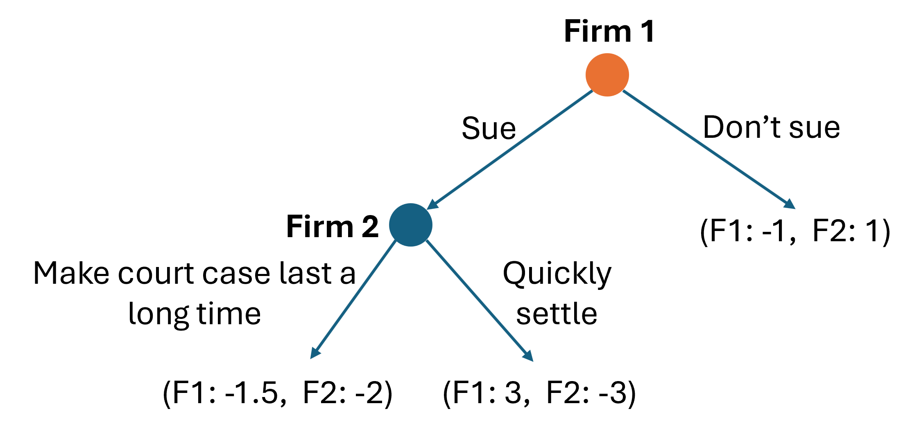

# Question 1

Ben and Cameron are sitting next to each other on a flight but do not know each other. Both Ben and Cameron would like to put their arm on the armrest, it would make them both comfortable. If they both put their arm on the armrest at the same time, they'll have an awkward conversation that makes both of them unhappy.

Below is their payoff matrix, showing how happy whether claiming the armrest or not would make them.

\renewcommand{\arraystretch}{3}
\begin{table}[htbp]
\begin{tabular}{llll}
                      &                                  & \multicolumn{2}{l}{\textbf{Ben}}                                                         \\
                      & \multicolumn{1}{l|}{}            & \multicolumn{1}{l|}{Claim armrest}                  & Don't claim armrest                          \\\cline{2-4} 
\multirow{2}{*}{\textbf{Cameron}} & \multicolumn{1}{l|}{Claim armrest} & \multicolumn{1}{l|}{B: -3, C: -2}   & B: 0, C: 2 \\ \cline{2-4} 
                      & \multicolumn{1}{l|}{Don't claim armrest}         & \multicolumn{1}{l|}{B: 1.5, C: 0} & B: 0, C: 0 \\ \cline{2-4} 
\end{tabular}
\end{table}

\vspace{12pt}

**Question 1 (a):**  What is Ben's best response to Cameron's actions? (2 points)

\vspace{12pt}

**Question 1 (b):** Does either player have a dominating strategy? If so, what are they? Explain your answer. (2 points)

\vspace{12pt}

**Question 1 (c):** Find all pure strategy (no randomization) Nash Equilibria. You can solve this in the payoff matrix, but make sure you write your final answer for the Nash Equilibria here. (4 points)

\vspace{12pt}

**Question 1 (d):** Find the mixed strategy (with randomization) Nash Equilibrium. (5 points)

\vspace{24pt}

# Question 2

Firm 2 is illegally entering a market where Firm 1 has regulated exclusivity. If Firm 2 enters, Firm 1 will make a loss. Firm 1 is considering suing Firm 2 for \$3. If Firm 2 gets sued, they have the option of quickly settling, and paying Firm 1 \$3; or they have the option of dragging out the court proceedings, increasing the legal costs and reducing how much Firm 1 will finally get paid.  Firm 1 will make its decision first. 

The following game tree shows the sequence and payoffs of this sequential/extensive form game.

\vspace{12pt}

**Question 2 (a):** Find the equilibrium outcome if Firm 1 and Firm 2 make their decisions optimally. (3 points)

\vspace{12pt}

**Question 2 (b):** Write the equilibrium outcome as a subgame perfect Nash Equilibrium, that is, the optimal strategy at each decision node. (2 points)

\vspace{24pt}

# Question 3

Sacramento Republic (soccer) and the A's (baseball) are competing to attract sports fans to their games. They both have stadiums with fixed amounts of seating, they must compete on the price they charge for tickets (Bertrand/price competition). 

Sacramento Republic has demand for tickets $q_{SR} =  12,000 - 800p_SR + 200p_A$; and total costs $TC_{SR} = 5q_{SR}$.

The A's has demand for tickets $q_{A} =  25,000 - 600p_{A} + 150p_{SR}$; and total costs $TC_{A} = 8q_{A}$.

\vspace{12pt}

**Question 3 (a):** Find Sacramento Republic's profit function in terms of $p_{SR}$ and $p_{A}$. (2 points)

\vspace{12pt}

**Question 3 (b):** Find the A's profit function in terms of $p_{SR}$ and $p_{A}$. (2 points)

\vspace{12pt}

**Question 3 (c):** Find Sacramento Republic's best response function if they compete in a Bertrand game (choosing prices). (2 points)

\vspace{12pt}

**Question 3 (d):** Find the A's best response function if they compete in a Bertrand game (choosing prices). (2 points)

\vspace{12pt}

**Question 3 (e):** Find the Nash Equilibrium prices and quantities of tickets sold for both Sacramento Republic and the A's (5 points)

\vspace{24pt}

# Question 4

There are two banks in Davis that provide mortages to customers. 

The willingnes to pay for a mortage is: $P = 8 - 0.0002 Q_{D}$.

Bank 1 has total costs of providing mortgages of $TC_{1} = 2 \times q_{1}$.

Bank 2 has total costs of providing mortgages of $TC_{2} = 2 \times q_{2}$.

\vspace{12pt}

**Question 4 (a):** Find each bank's best response functions if they are competing in a Cournot game (competing by choosing quantities). (6 points)

\vspace{12pt}

**Question 4 (b):** Find the Nash equilibrium quantity of mortgages provided for each bank and the market price for mortgages in the Cournot game. (6 points)

\vspace{12pt}

**Question 4 (c):** Find each bank's profit in the Nash equilibrium of the Cournot game. (1 point)

\vspace{12pt}

**Question 4 (d):** The banks meet up in a dark corner at G Street Wunderbar and agree to collude to act as a cartel monopoly. They agree to split collusion output and profit 50\% each. Find the collusion/cartel monopoly price, output and profit for each bank. (6 points)

\vspace{12pt}

**Question 4 (e):** If Bank 1 sticks to the collusive output you found in part (d), does Bank 2 have an incentive to cheat the cartel? (6 point)

