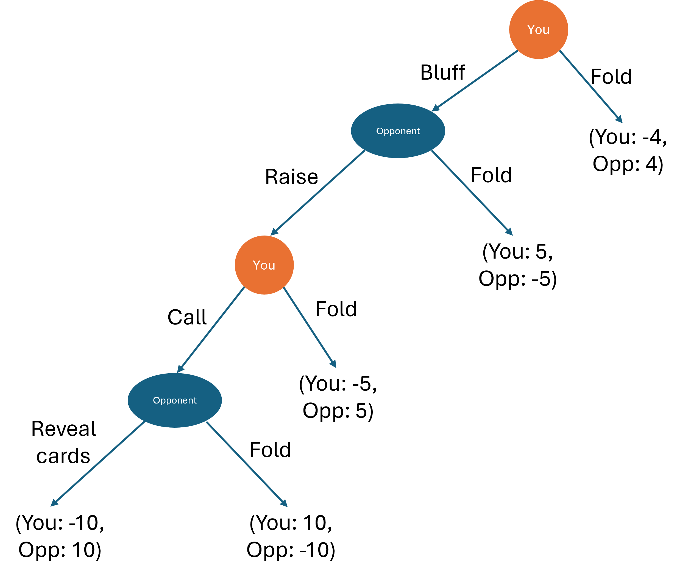

# Question 1

You are at the poker table facing one other opponent. You need to decide on your next moves. The below game tree shows the sequence and payoffs of this sequential/extensive form game that you expect given the cards you have in your hand.

\vspace{12pt}

**Question 1 (a):** Find the equilibrium outcome if you and your opponent make their decisions optimally. 

\begin{mybox}

The equilibrium outcome is that you would fold, and you would get -4 and the opponent would get 4.

If you did this correctly, this would be sufficient for full marks. If not, part marks will be awarded for how you solved the game on the game tree or reasoned through it in words. So if you're unsure, write the full justification!

\end{mybox}

\vspace{12pt}

**Question 1 (b):** Write the equilibrium outcome as a subgame perfect Nash Equilibrium, that is, the optimal strategy at each decision node. 

\begin{mybox}

The subgame perfect NE needs the optimal strategy of each player at each node.

Here it is:
\begin{equation*}\begin{aligned}
    \left( \left( \underbrace{\text{Fold}, \text{Fold}}_{\text{You}} \right), \left(\underbrace{\text{Raise}, \text{Reveal cards}}_{\text{Opponents}} \right) \right)
\end{aligned}\end{equation*}

Similar to above, this would be sufficient for full marks, but if there's a mistake, it would require additional justification to get part marks. Not picky about how you write the answer (can just be in words rather than all of the parentheses).

\end{mybox}

\vspace{12pt}

# Question 2

Abigail and Brooklyn are both choosing which sort of car to buy. They can both choose small or large cars. Safety is their key concern and the following payoff matrix shows the probability they will be injured in a crash (lower is better).

\renewcommand{\arraystretch}{3}
\begin{table}[htbp]
\begin{tabular}{llll}
                      &                                  & \multicolumn{2}{l}{\textbf{Abigail}}                                                         \\
                      & \multicolumn{1}{l|}{}            & \multicolumn{1}{l|}{Buy small car}                  & Buy large car                          \\\cline{2-4} 
\multirow{2}{*}{\textbf{Brooklyn}} & \multicolumn{1}{l|}{Buy small car} & \multicolumn{1}{l|}{A: 10\%, B: 10\%}   & A: 8\%, B: 12\% \\ \cline{2-4} 
                      & \multicolumn{1}{l|}{Buy large car}         & \multicolumn{1}{l|}{A: 12\%, B: 8\%} & A: 15\%, B: 10\% \\ \cline{2-4} 
\end{tabular}
\end{table}

\vspace{12pt}

**Question 2 (a):**  What is Abigail's best response to Brooklyn's actions? 

\begin{mybox}

If Brooklyn buys a small car: Abigail chooses between 10\% (small) vs 8\% (large)
$\Rightarrow$ \textbf{Abigail buys a large car}

If Brooklyn buys a large car: Abigail chooses between 12\% (small) vs 15\% (large)  
$\Rightarrow$ \textbf{Abigail buys a small car}

\textbf{Abigail's best response:}
- Buy large car when Brooklyn buys small car
- Buy small car when Brooklyn buys large car

Key part of the answer is that you need the optimal action for both of Brooklyn's possible moves

\end{mybox}

\vspace{12pt}

**Question 2 (b):** Does either player have a dominating strategy? If so, what are they?  

\begin{mybox}

Yes, Brooklyn has a dominating strategy to buy a large car.

\end{mybox}

\vspace{12pt}

**Question 2 (c):** Find all pure strategy (no randomization) Nash Equilibria. You can solve this in the payoff matrix, but make sure you write your final answer for the Nash Equilibria here.

\begin{mybox}

\textbf{Nash Equilibrium: (Abigail: Small car, Brooklyn: Large car)}

If correct, that would be sufficient for full marks. If incorrect, would need to see justification here or arrows on the payoff matrix to award part marks.

Justification might look like:

Since Brooklyn has a dominant strategy (buy large car), we know Brooklyn will choose large car.

Given Brooklyn chooses large car, Abigail's best response is to buy small car (12\% < 15\%).

Checking if Brooklyn would deviate: If Abigail buys small car, Brooklyn's best response is large car (8\% < 10\%).

\end{mybox}

\vspace{12pt}

# Question 3

Firm 1 and Firm 2 are deciding whether to enter a market or not. The payoff matrix below shows their profits given which firms enter the market.

\renewcommand{\arraystretch}{3}
\begin{table}[htbp]
\begin{tabular}{llll}
                      &                                  & \multicolumn{2}{l}{\textbf{Firm 1}}                                                         \\
                      & \multicolumn{1}{l|}{}            & \multicolumn{1}{l|}{Enter}                  & Don't enter                          \\\cline{2-4} 
\multirow{2}{*}{\textbf{Firm 2}} & \multicolumn{1}{l|}{Enter} & \multicolumn{1}{l|}{F1: -4, F2: -3}   & F1: 0, F2: 6 \\ \cline{2-4} 
                      & \multicolumn{1}{l|}{Don't enter}         & \multicolumn{1}{l|}{F1: 5, F2: 0} & F1: 0, F2: 0 \\ \cline{2-4} 
\end{tabular}
\end{table}

**Question 3 (a):** Find the mixed strategy (with randomisation) Nash Equilibrium

\begin{mybox}

Let $p_1$ = probability Firm 1 enters, $p_2$ = probability Firm 2 enters.

For Firm 2 to be indifferent:
\begin{equation*}\begin{aligned}
    E[\pi_2|\text{Enter}] = E[\pi_2|\text{Don't enter}]\\   
    p_1(-3) + (1-p_1)(6) = p_1(0) + (1-p_1)(0)\\
    -3p_1 + 6 - 6p_1 = 0\\
    6 - 9p_1 = 0\\
    p_1^* = \frac{2}{3}\\
\end{aligned}\end{equation*}

For Firm 1 to be indifferent:
\begin{equation*}\begin{aligned}
    E[\pi_1|\text{Enter}] = E[\pi_1|\text{Don't enter}]\\
    p_2(-4) + (1-p_2)(5) = p_2(0) + (1-p_2)(0)\\
    -4p_2 + 5 - 5p_2 = 0\\
    5 - 9p_2 = 0\\
    p_2^* = \frac{5}{9}\\
\end{aligned}\end{equation*}

So the mixed strategy NE is:
\begin{itemize}
    \item For firm 1:
    \begin{itemize}
        \item Entering with $\frac{2}{3}$ probability
        \item Not entering with $\frac{1}{3}$ probability
    \end{itemize}
    \item For firm 2:
    \begin{itemize}
        \item Entering with $\frac{5}{9}$ probability
        \item Not entering with $\frac{4}{9}$ probability
    \end{itemize}
\end{itemize}

For full marks, we need to see the full set of strategies and their probabilities, rather than just finding the two entry probabilities

\end{mybox}

\vspace{12pt}

# Question 4

The NFL makes a lot of its money from selling the broadcast rights to its games. 

Say the demand for the NFL's broadcast rights is: $P = 1,000 - 250Q_{D}$. 

For simplicity, say that there are only two teams in the NFL, the 49ers and the Eagles. The total cost of providing games for broadcast for each team is:
\begin{itemize}
    \item For the 49ers: $TC_{49} = 200q_{49}$
    \item For the Eagles: $TC_{E} = 200q_{E}$
\end{itemize}

The NFL organises itself as a cartel to get monopoly prices for selling its broadcast rights - ie, individual teams don't sell their own rights, limiting competition. The NFL splits the profits and outputs in the cartel equally amongst its members.

**Question 4 (a):** What is the price and total quantity for broadcast when the NFL operates as a cartel?

\begin{mybox}

Cartel acts as monopoly. Total marginal cost = $MC = 200$ (since $MC_{49} = MC_E = 200$).

Marginal revenue: $MR = 1000 - 500Q$ (derivative of $TR = 1000Q - 250Q^2$)

Setting $MR = MC$:
$1000 - 500Q = 200$
$800 = 500Q$
$Q^{cartel} = 1.6$

Price: $P^{cartel} = 1000 - 250(1.6) = 1000 - 400 = 600$

\textbf{Cartel price = \$600, Total quantity = 1.6}

\end{mybox}

\vspace{12pt}

**Question 4 (b):** What is the profit for each individual team, the 49ers and the Eagles, when the NFL operates as a cartel?

\begin{mybox}

Total revenue = $P \times Q = 600 \times 1.6 = 960$
Total cost = $200 \times 1.6 = 320$  
Total profit = $960 - 320 = 640$

Since profits are split equally:
$\pi_{49} = \pi_E = \frac{640}{2} = 320$

Each team produces $q_{49} = q_E = \frac{1.6}{2} = 0.8$

\textbf{Profit for each team = \$320}

\end{mybox}

\vspace{12pt}

**Question 4 (c):** The NFL imposes big fines on its members if anyone tries to cheat the cartel. Suppose that the NFL would fine a team \$150 for cheating the cartel and selling additional broadcast rights. Would the 49ers cheat the cartel?

\begin{mybox}

If 49ers cheat while Eagles stick to cartel output of 0.8 (50\% of the cartel output):

We want to find 49ers profit maximising output, by finding their best response function. 

First we find their profit function:

\begin{equation*}\begin{aligned}
 \pi_{49} = (1000 - 250q_{49} - 250q_{E})q_{49} - 200q_{49}\\   
 \pi_{49} = (800 - 250q_{49})q_{49} - 250q_{E}q_{49}\\
 \pi_{49} = 800q_{49} - 250q_{49}^2 - 250q_{E}q_{49}\\
 \pi_{49} = 800q_{49} - 250q_{49}^2  - 250q_{E}q_{49}\\
\end{aligned}\end{equation*}

Maximising their profit by setting the derivative equal to zero yields the BR function:
\begin{equation*}\begin{aligned}
 \frac{d\pi_{49}}{dq_{49}} = 800 - 250q_{E}  = 500q_{49}\\  
 q_{49}^{cheat} =BR_{49}= 1.6 - \frac{1}{2}q_{E}\\
\end{aligned}\end{equation*}

So the 49ers best cheating output would be: $q_{49}^{cheat} = 1.6 - \frac{1}{2} \times 0.8 =0 1.2$

The 49ers cheating profit, including the fine is:
$\pi_{49}^{cheat} = 600(1.2) - 250(1.2)^2 - 150 = 720 - 360 - 150 = 210$

Since $\pi_{49}^{cheat} = 210 < \pi_{49}^{cartel} = 320$:

\textbf{No, the 49ers would not cheat the cartel (even with the fine, cheating gives lower profit than cooperating)}

\end{mybox}

# Question 5

J&J is about to launch a new drug onto the market. 

The inverse demand for this drug is $P = 15,000 - Q_{D}$. 

J&J has total costs $TC_{JJ} = 1,500q_{JJ}$.

**Question 5 (a):** If J&J enters the drug market as a monopoly, what is the price and quantity of this drug that will be sold?

\begin{mybox}

Monopoly: $MR = MC$

Marginal revenue: $MR = 15,000 - 2Q$ (derivative of $TR = 15,000Q - Q^2$)

Marginal cost: $MC = 1,500$

Setting $MR = MC$:
\begin{equation*}\begin{aligned}
 15,000 - 2Q = 1,500\\
13,500 = 2Q\\
Q^m = 6,750\\
\end{aligned}\end{equation*}

So the monopoly price is:
$P^m = 15,000 - 6,750 = 8,250$

\end{mybox}

\vspace{12pt}

**Question 5 (b):** If J&J enters the drug market as a monopoly, what is the consumer surplus?

\begin{mybox}

Consumer surplus = $\frac{1}{2} \times \text{base} \times \text{height}$

Base = quantity = 6,750
Height = maximum price - market price = 15,000 - 8,250 = 6,750

$CS^m = \frac{1}{2} \times 6,750 \times 6,750 = \frac{45,562,500}{2} = 22,781,250$

\textbf{Consumer surplus = \$22,781,250}

\end{mybox}

\vspace{12pt} 

**Question 5 (c):** Suppose a new firm, Anova drugs, now chooses to enter the market after J&J. Anova has total costs $TC_{A} = 1,200q_{A}$. What is the price and quantity of the the drug that will be sold if J&J and Anova compete in a Stackelberg game (J&J enters first, both compete on quantity)?

\begin{mybox}

Stackelberg: J\&J is leader, Anova is follower.

Anova's best response function:
\begin{equation*}\begin{aligned}
\max_{q_A} (15,000 - q_{JJ} - q_A)q_A - 1,200q_A\\
\frac{d\pi_A}{dq_A} = 15,000 - q_{JJ} - 2q_A - 1,200 = 0\\
q_A = \frac{13,800 - q_{JJ}}{2}\\
\end{aligned}\end{equation*}

J\&J anticipates this and maximizes:
\begin{equation*}\begin{aligned}
\pi_{JJ} = (15,000 - q_{JJ} - q_A)q_{JJ} - 1,500q_{JJ}\\
\end{aligned}\end{equation*}

\begin{equation*}\begin{aligned}
Substituting Anova's best response:
\pi_{JJ} = \left(15,000 - q_{JJ} - \frac{13,800 - q_{JJ}}{2}\right)q_{JJ} - 1,500q_{JJ}\\
\pi_{JJ} = \left(\frac{30,000 - 2q_{JJ} - 13,800 + q_{JJ}}{2}\right)q_{JJ} - 1,500q_{JJ}\\
\pi_{JJ} = \left(\frac{16,200 - q_{JJ}}{2}\right)q_{JJ} - 1,500q_{JJ}\\
\pi_{JJ} = 6,600q_{JJ} - \frac{1}{2}q_{JJ}^{2}\\    
\end{aligned}\end{equation*}

Maximising J\&J's profit yields their first mover output:
\begin{equation*}\begin{aligned}
\frac{d\pi_{JJ}}{dq_{JJ}} = 6,600 - q_{JJ} = 0\\
q_{JJ}^* = 6,600\\    
\end{aligned}\end{equation*}

So Anova's output is:

$q_A^* = \frac{13,800 - 6,600}{2} = 3,600$

Total quantity = 6,600 + 3,600 = 10,200

And so the price is:

$P^S = 15,000 - 10,200 = 4,800$

\textbf{Stackelberg price = \$4,800, Total quantity = 10,200}
\textbf{J\&J quantity = 6,600, Anova quantity = 3,600}

\end{mybox}

\vspace{12pt}

**Question 5 (d):** How much better off are consumers from Anova entering the market, relative to when J&J was a monopoly?

\begin{mybox}

Consumer surplus in Stackelberg:
$CS^S = \frac{1}{2} \times 10,200 \times (15,000 - 4,800) = \frac{1}{2} \times 10,200 \times 10,200 = 52,020,000$

Consumer surplus in monopoly: $CS^m = 22,781,250$

Improvement in consumer surplus:
$\Delta CS = 52,020,000 - 22,781,250 = 29,238,750$

\textbf{Consumers are \$29,238,750 better off when Anova enters the market}

\end{mybox}