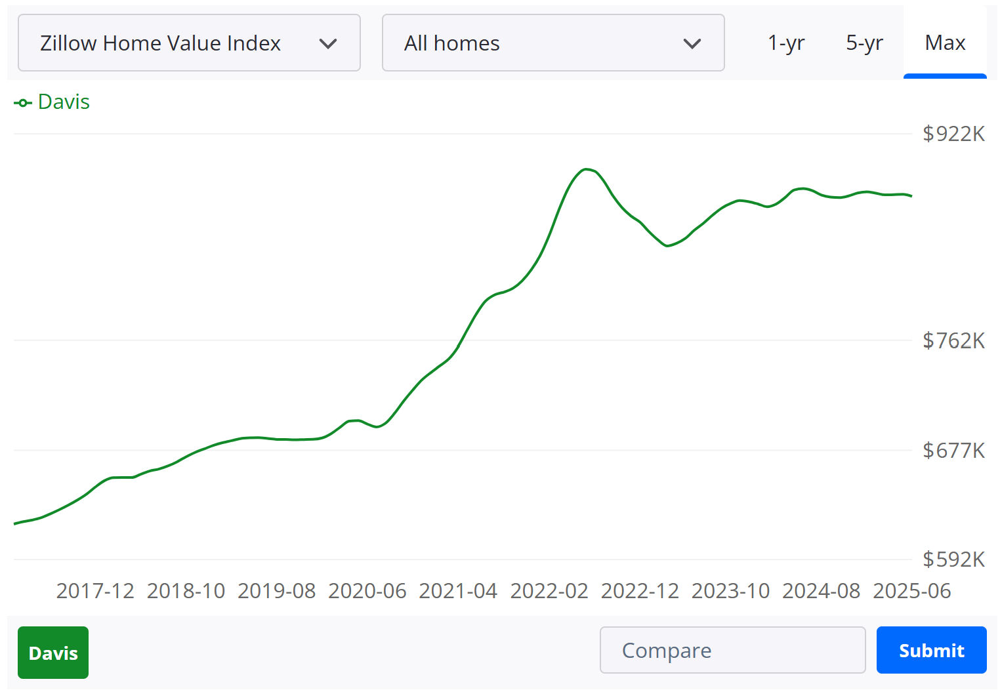

<head>
  <link rel="stylesheet" href="styles.css">
</head>

# Imperfect competition

- In ARE100A, you learnt about perfect competition

↪ Useful for a theoretical sense, but very little in the real world can be related to perfect competition

- This class teaches two departures from perfect competition

↪ Market power

↪ Strategic thinking

# Power in the real world

The below shows the total UC system undergraduate enrollment over time and the combined value of all system-wide endowments

```{r echo=FALSE,warning=FALSE,error=FALSE,message=FALSE,cache=FALSE}
        library(tidyverse)
        total_data <-
structure(list(year = c(2023, 2023, 2024, 2024, 2022, 2022, 2021, 
2021, 2020, 2020, 2019, 2019, 2018, 2018, 2017, 2017, 2016, 2016, 
2015, 2015, 2014, 2014, 2013, 2013, 2012, 2012, 2011, 2011, 2024, 
2024, 2023, 2023, 2022, 2022, 2021, 2021, 2020, 2020, 2019, 2019, 
2018, 2018, 2017, 2017, 2016, 2016, 2015, 2015), type = c("University of California", 
"University of California", "University of California", "University of California", 
"University of California", "University of California", "University of California", 
"University of California", "University of California", "University of California", 
"University of California", "University of California", "University of California", 
"University of California", "University of California", "University of California", 
"University of California", "University of California", "University of California", 
"University of California", "University of California", "University of California", 
"University of California", "University of California", "University of California", 
"University of California", "University of California", "University of California", 
"Ivy League", "Ivy League", "Ivy League", "Ivy League", "Ivy League", 
"Ivy League", "Ivy League", "Ivy League", "Ivy League", "Ivy League", 
"Ivy League", "Ivy League", "Ivy League", "Ivy League", "Ivy League", 
"Ivy League", "Ivy League", "Ivy League", NA, NA), name = c("Total endowment ($ billion)", 
"Total undergrad enrollment", "Total endowment ($ billion)", 
"Total undergrad enrollment", "Total endowment ($ billion)", 
"Total undergrad enrollment", "Total endowment ($ billion)", 
"Total undergrad enrollment", "Total endowment ($ billion)", 
"Total undergrad enrollment", "Total endowment ($ billion)", 
"Total undergrad enrollment", "Total endowment ($ billion)", 
"Total undergrad enrollment", "Total endowment ($ billion)", 
"Total undergrad enrollment", "Total endowment ($ billion)", 
"Total undergrad enrollment", "Total endowment ($ billion)", 
"Total undergrad enrollment", "Total endowment ($ billion)", 
"Total undergrad enrollment", "Total endowment ($ billion)", 
"Total undergrad enrollment", "Total endowment ($ billion)", 
"Total undergrad enrollment", "Total endowment ($ billion)", 
"Total undergrad enrollment", "Total endowment ($ billion)", 
"Total undergrad enrollment", "Total endowment ($ billion)", 
"Total undergrad enrollment", "Total endowment ($ billion)", 
"Total undergrad enrollment", "Total endowment ($ billion)", 
"Total undergrad enrollment", "Total endowment ($ billion)", 
"Total undergrad enrollment", "Total endowment ($ billion)", 
"Total undergrad enrollment", "Total endowment ($ billion)", 
"Total undergrad enrollment", "Total endowment ($ billion)", 
"Total undergrad enrollment", "Total endowment ($ billion)", 
"Total undergrad enrollment", "Total endowment ($ billion)", 
"Total undergrad enrollment"), value = c(20.699999999999999, 
231694, 22.5, 232782, 27.899999999999999, 229023, 29.800000000000001, 
229179, 22, 226239, 21.100000000000001, 225918, 16.899999999999999, 
222306, 14.5, 216542, 14.4, 210023, 14.5, 189780, 13.1, 194736, 
11.199999999999999, 187907, 10.199999999999999, 183061, 10.6, 
181025, 189.80000000000001, 65560, 181.18181820000001, 84672, 
182.83801650000001, 87424, 190.0618332, 92516, 141.5471211, 90880, 
137.1882919, 90388, 132.28026539999999, 92040, 123.1184231, 93672, 
115.5985664, 98064, 117.61687860000001, NA)), class = c("tbl_df", 
"tbl", "data.frame"), row.names = c(NA, -48L))

ggplot() +
        facet_wrap(~name, scales = "free_y", ncol = 1) +
        geom_line(
                data = total_data %>% filter(type == "University of California", year >= 2015),
                aes(x = year, y = value, col = type),
                linewidth = 1.2
        ) +
        geom_point(data = tibble(year = 2015, name = "Total undergrad enrollment", value = 0),
        aes(x = year, y = value), alpha = 0) +
        geom_point(data = tibble(year = 2015, name = "Total endowment ($ billion)", value = 0),
        aes(x = year, y = value), alpha = 0) +
        labs(x = "Year", y = NULL) +
        theme_bw(base_size = 9) +
        theme_minimal() +
        theme(
        panel.grid.minor = element_blank(),
        axis.title = element_text(size = 12),
        axis.text = element_text(size = 10),
        legend.position = "bottom"
        ) +
        scale_color_manual(name = NULL, values = c("University of California" = "darkblue", "Ivy League" = "darkred"),
        breaks = c("University of California", "Ivy League")) +
        scale_y_continuous(labels = scales::comma) +
        scale_x_continuous(breaks = 2015 + 0:9)

        
```

# Power in the real world

Adding in total Ivy Leagure undergraduate enrollment numbers - seems like a tough business for Ivy League schools

```{r echo=FALSE,warning=FALSE,error=FALSE,message=FALSE,cache=FALSE}
        
        ggplot() +
        facet_wrap(~name, scales = "free_y", ncol = 1) +
        geom_line(
                data = total_data %>% filter(type == "University of California" | name == "Total undergrad enrollment", year >= 2015),
                aes(x = year, y = value, col = type),
                linewidth = 1.2
        ) +
        geom_point(data = tibble(year = 2015, name = "Total undergrad enrollment", value = 0),
        aes(x = year, y = value), alpha = 0) +
        geom_point(data = tibble(year = 2015, name = "Total endowment ($ billion)", value = 0),
        aes(x = year, y = value), alpha = 0) +
        labs(x = "Year", y = NULL) +
        theme_bw(base_size = 9) +
        theme_minimal() +
        theme(
        panel.grid.minor = element_blank(),
        axis.title = element_text(size = 12),
        axis.text = element_text(size = 10),
        legend.position = "bottom"
        ) +
        scale_color_manual(name = NULL, values = c("University of California" = "darkblue", "Ivy League" = "darkred"),
        breaks = c("University of California", "Ivy League")) +
        scale_y_continuous(labels = scales::comma) +
        scale_x_continuous(breaks = 2015 + 0:9)
        
```

# Power in the real world

But instead - their value is booming!

```{r echo=FALSE,warning=FALSE,error=FALSE,message=FALSE,cache=FALSE}
        
        ggplot() +
        facet_wrap(~name, scales = "free_y", ncol = 1) +
        geom_line(
                data = total_data %>% filter(year >= 2015),
                aes(x = year, y = value, col = type),
                linewidth = 1.2
        ) +
        geom_point(data = tibble(year = 2015, name = "Total undergrad enrollment", value = 0),
        aes(x = year, y = value), alpha = 0) +
        geom_point(data = tibble(year = 2015, name = "Total endowment ($ billion)", value = 0),
        aes(x = year, y = value), alpha = 0) +
        labs(x = "Year", y = NULL) +
        theme_bw(base_size = 9) +
        theme_minimal() +
        theme(
        panel.grid.minor = element_blank(),
        axis.title = element_text(size = 12),
        axis.text = element_text(size = 10),
        legend.position = "bottom"
        ) +
        scale_color_manual(name = NULL, values = c("University of California" = "darkblue", "Ivy League" = "darkred"),
        breaks = c("University of California", "Ivy League")) +
        scale_y_continuous(labels = scales::comma) +
        scale_x_continuous(breaks = 2015 + 0:9)
        
```


# Power in the real world

Ivy League schools and the UC system have very different approaches:

- UC aims to provide elite education to a wide set of people

- Ivy League aims to be `prestigious' - and being very judicious in who it enrolls

- This gives it power to earn a lot of money by educating not that many people

This is very different from a business without market power - where selling less would make them less profitable 

Ultimately, this makes society worse off - some of our best institutions are incentivized to educate fewer people!


# Power in the real world

Power shows up in a lot of different ways:

- **Increased prices**: Ivy League education, Rolex watches, cinema/stadium food and drink

- **Decreased service quality**: Woeful Amtrak service schedules

- **Need to buy related products**: iPhone specific chargers, printer ink, drill batteries

- **Regulation**: Davis housing policies





# Strategic thinking and game theory

So many of our opportunities in the real world depend not just on our own actions, but the actions of others too

- This means we need to think strategically - anticipating the incentives of our `competitors'


# Strategic thinking and game theory

Because of grade curving, how well you do depends not just on how much you study, but on how much your peers study too


> - If everyone studies hard, everyone gets an A

> - If some don't study, they'll get a C; the rest that study hard will get an A

> - If nobody studies, I'll be forced to curve the class and you'll all get Bs

> - **Strategy:** If you know you don't want to study for this class, you should be convincing your classmates to reinstall TikTok, start playing Starcraft, etc

# Strategic thinking and game theory

We'll mostly be using stategic thinking to reason about how business compete with one another

But this is used in so many settings:

- Poker, baseball pitching, soccer penalties all heavily use strategic thinking

- Business negotiations, international politics (the current tariff wars!)

- Traffic flows

# Admin for this course

- Two TAs: Hyunjung and Dio

- Stuart's office hours: Mondays and Wednesdays: 2:30pm-4:00pm in SSH 2141

- Email TAs about course material questions

- Email me about admin, assessment extensions, etc: smorrison@ucdavis.edu

# Assessment for this course

Midterm:

- Monday 18 August during lecture time (12:10pm-1:50pm)

Final:

- During week starting 8 September
- Covers entire course (but more weight to second half of the course)

Exam grades:

- If you do better in the midterm than in the final: both the midterm and final are worth 37.5% of your grade each

- If you do better in the final: final is worth 75% of your grade


# Assessment for this course

Canvas quizzes:

- Due each Monday at 11:59pm starting 11 August

- Covers the material for the week before

- 30 minutes per attempt

- Two attempts per quiz, taking your highest grade

- Five quizzes total, each worth 5% of your grade each


