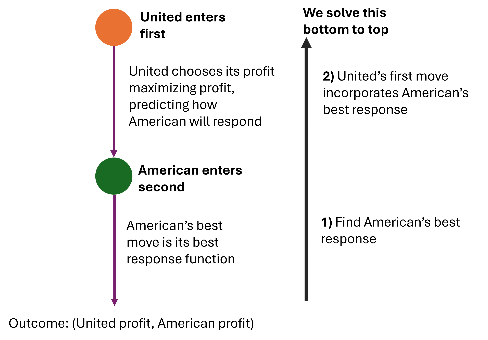

<head>
  <link rel="stylesheet" href="styles.css">
</head>

# Our last model of competition

- We are going to add a little spice to the Cournot (choosing quantity model)

- We will let one firm go first (just like our sequential games!)

- We call this our Stackelberg model of competition

# Why does someone going first change things?

- Often the first firm into the market keeps a high amount of market share. Consumers are reluctant to switch brands.

- iPhone was first into the true touch-screen phones and has held enormous share since then

- We are going to model this as a strategic phenomenon, entering first means that your rivals have to respond to your actions

# Why does someone going first change things?

**Simultaneous games:**

- Both players react to each other at the same time

- Nash Equilibrium when both firms' best response functions coincide/intersect with each other

\vspace{12pt}

**Sequential games:**

- Only the second mover responds to the first mover

- The first mover dictates how the game will play out

- Nash Equilibrium when the second mover does its best response to the first mover

# Why does someone going first change things?

How does this map into our models of firm competition?

**Simultaneous games:** (Cournot and Bertrand games)

- We find both players' best response functions

- Cournot/Bertrand Nash equilibria are at the intersection of the best response functions

\vspace{12pt}

**Our new sequential Stackleberg game:**

- We find the best response function of the second mover

- First mover considers the second mover's best response in their decisions

# Let's go back to our airline example

- American Airlines and United are competing to sell flights from Sacramento to LA

- Inverse demand for this route is $P = 339 - Q_{D}$

- Both airlines have no fixed costs and constant marginal costs of \$147

- But now let's say that **United** enters the market first, then **American** follows

# How do we approach this?

**1 -** Find market demand as a function of how much each firm supplies

**2 -** Find the best response function for our second mover - how much should the second mover sell as a function of other the first mover's quantities

**3 -** Maximise the first mover's profit, using the second mover's best response function

# Solving the airline example as a Stackelberg

**These steps are like solving our subgames from bottom to top**

# Solving the airline example as a Stackelberg

**1 -** Market demand. We have market demand as a function of both airlines as:
\begin{equation*}\begin{aligned}
    P = 339 - q_{U} - q_{A}
\end{aligned}\end{equation*}

# Solving the airline example as a Stackelberg

**2 -** Find American's (second mover) best response function:

American's profit function is:
\begin{equation*}\begin{aligned}
    \pi_{A} = & (339 - (q_{U} + q_{A}))q_{A} - 147 \times q_{A}\\
    =& 339q_{A} - q_{U}q_{A} - q_{A}^{2} - 147q_{A}\\
\end{aligned}\end{equation*}

American's best response function is:
\begin{equation*}\begin{aligned}
    \frac{d\pi_{A}}{dq_{A}} =& 339 - q_{U} - 2q_{A} - 147 = 0\\
    &-2q_{A} = -192+ q_{U}\\
    &q_{A} = BR_{A} = 96 - \frac{1}{2}q_{U}\\
\end{aligned}\end{equation*}

# Solving the airline example as a Stackelberg

**3 -** Optimise United (our first mover's) profit using American's best response function:

- Where we see American's quantity, $q_{A}$, we substitute in American's best response function

\begin{equation*}\begin{aligned}
    \pi_{U} &=  339q_{U} - q_U\times \color{red}{q_{A}} - q_{U}^{2} - 147 \times q_{U}\\
        &=  339q_{U} - q_U\times \color{red}{(96 - \frac{1}{2}q_{U})} - q_{U}^{2} - 147 \times q_{U}\\
        &=  339q_{U} - 96q_U + \frac{1}{2}q_{U}^{2} - q_{U}^{2} - 147 \times q_{U}\\
        &=  339q_{U} - 96q_U + \frac{1}{2}q_{U}^{2} - q_{U}^{2} - 147 \times q_{U}\\
        &=96q_{U} - \frac{1}{2}q_{U}^{2}\\
\end{aligned}\end{equation*}

**Intuition here:** United knows how American will respond to its entry, so it maximises its profit already knowing that response!

And we optimise United's profit:
\begin{equation*}\begin{aligned}
    \frac{d\pi_{U}}{dq_{U}} = &96 - q_{U} = 0\\
    &q_{U} = 96\\
\end{aligned}\end{equation*}

# Solving the airline example as a Stackelberg

- We have United, our first mover will sell 96 flights

- American, our second mover, will sell $q_{A} = 96 - \frac{1}{2} \times 96 = 48 \text{ flights}$.

- Compare this against our original Cournot game, where each would sell 64 each! 

- United entering the market first lets them capture more the original market before American can enter!

# Why is the Stackelberg equilibrium different?

- Why does the first mover get to sell more than in the original Cournot (simultaneously choosing quantities) game

- The first mover gets to force the hand of the second mover - by moving first, the first mover can take more of the demand

- The second mover has to just take whatever's left

- In the original game, they're competing on a level playing field - both responding to each other simultaneously