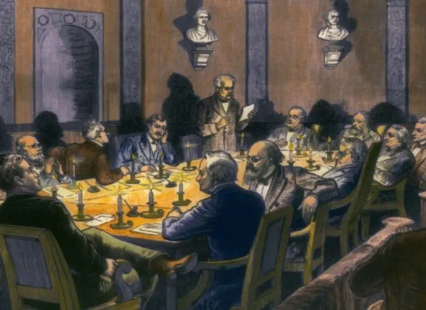
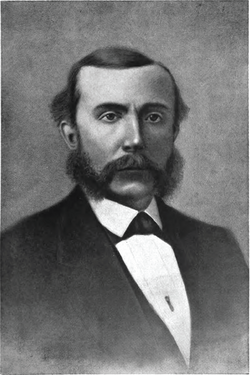
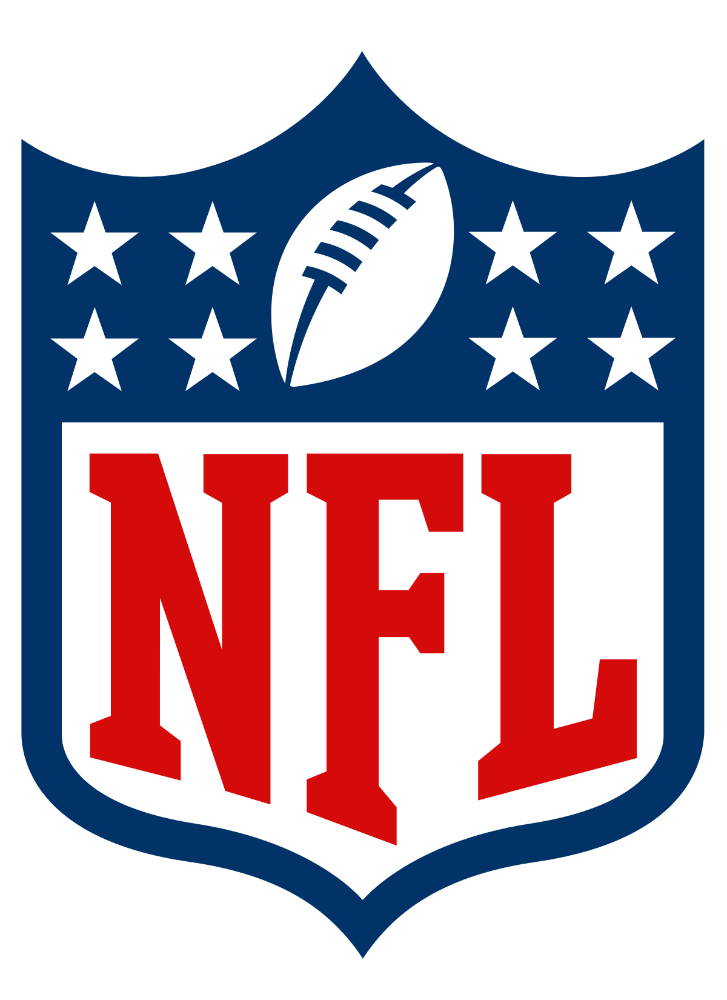
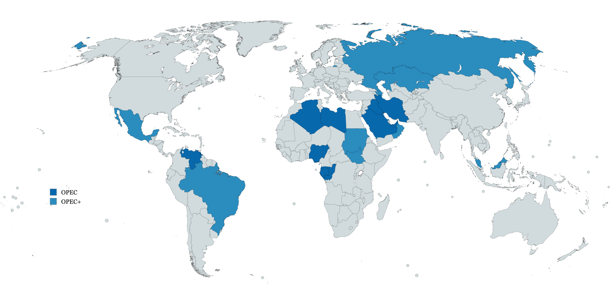
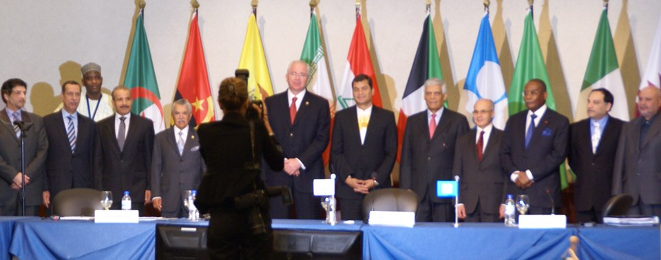

<head>
  <link rel="stylesheet" href="styles.css">
</head>

# Firms don't always want to compete

- In one of our first lessons, we learnt that when a firm acts as a monopoly, it gets it highest profit possible

- But often there are competitors, our models showed last week that this drives prices down and decreases total industry profits

- But what if firms don't want to compete?...

# Competition breaks down under collusion

- What if competitors got together and agreed not to compete

- Could they act as a monopoly? Could they all be better off?

- This is known as collusion - a group of colluding firms is known as a cartel

- In almost every country, this is very strictly illegal (with few exceptions)

# Cartel laws in the USA

- There have been strong anti-collusion/anti-cartel since the 1890s in the Sherman Act (which remains by-and-large in its original form)

- Born out of John D Rockefeller gaining strong market power in the railway and oil industries

- Policed by the FTC and Department of Justice ever since

- One of the few corporate crimes that can actually get you sent to prison

# How collusion and cartels operate

- A group of competitors agree to stop competing with one another - a hard part - how do you do this without leaving a paper trail

- Usually requires a concentrated market to capture all possible producers - hard to get many, many firms to agree to cheat the market!

- Typically they agree on all reducing output or bidding higher prices

- Depending on the arrangements, members of the cartels will share revenue/profit with one another to make everyone better off relative to the competitive outcome

- Often cartels need monitoring of each other's behaviour to make sure they're not cheating the cartel - there is a big incentive to undercut the cartel

- Occasionally cartels impose penalties on the cheaters - very hard to enforce though! 

# Cartel laws in the USA

- Lots of collusion in large industrial companies

- **United States v. O'Brien, et al. (2022)**: Three Florida military equipment manufacturers organised ahead of time who would win bids/tenders to provide equipment to the US Army. Subverting the idea of competitive tender to keep equipment procurement affordable

- **United States v. Dornsbach, et al. (2022)**: A group of concrete suppliers rigged the bidding process for large construction contracts. Making it difficult for construction companies to get well-priced materials

- Buyers think they are getting competitive prices, but producers have conspired to increase their prices and profits subverting competitive forces

# But there are still some legalised cartels

- The NFL (and other sports leagues) operate as a cartel

- There are a small collection of firms (teams) that agree to not let other competitors in and share revenue

- They coordinate in their labor hiring, through agreed team salary caps, driving down salaries for players

- Ideally each team should also (economically) compete with each other over media, licensing and merchandise deals - instead they drive up prices of this

- In addition. revenue from these sources is shared equally to all NFL 

- Also, breaches of salaries caps cause the league to fine the teams!

# Let's think of our economic models

- Let's think of how we can model this conduct in our economic models

- **But first, who wants to win \$5?**

- Last week, we showed that if two people bid against each other, it will drive the price down

- What if our "competitors" act together, can they make any money?

# But first, who wants to win \$5?

- Assuming that went well, our competitors should have refused to bid against each other

- Ideally, they should have split the prize money after the auction

- This is essentially our case of collusion: Rather than competiting, competitors can work together to increase their profit

# What are we going to study with collusion?

There are two main questions we want to answer for any particular market:

- Would competitors rather collude rather than compete?

- If competitors collude, would anyone rather cheat their colluders to capture even higher profits? 

# The case of OPEC

- The Organisation of Petroleum Exporting Countries (OPEC) is a collection of countries that agree to withold oil production to increase global prices

- It's the world's largest case of collusion - accounting for about 40\% of total global oil production and 79\% of total oil reserves

- Member countries agree on their total annual exports (quotas) with a goal to hit a certain international price

- Because the members are countries - not companies - this cartel is not illegal by any nation's antitrust laws

# The case of OPEC

- Withholding oil production increases the global prices, and so individual countries' profits

- However, there's an incentive to cheat - at high prices, members often export much more than their quota 

- Members try to hide this cheating - but OPEC enforces no penalties for members that cheat

# Let's try and put this into our models

Saudi Arabia and Venezuela are large oil producing countries. It takes them both of \$20 to produce a barrel of oil (constant marginal cost). 

Inverse total demand for oil is $P = 100 - Q$

We are going to find:

**1 -** What are the prices, quantities and profits if they compete on quantities (Cournot)

**2 -** What are the prices, quantities and profits if they collude and act as a monopoly

**3 -** Does either firm have an incentive to cheat/deviate?

# Let's find outcomes under Cournot competition

Our profit functions are:
\begin{equation*}\begin{aligned}
  \pi_{SA} = (100 - q_{SA} - q_{V})q_{SA} - 20q_{SA}\\
  \pi_{V} = (100 - q_{SA} - q_{V})q_{V} - 20q_{V}\\
\end{aligned}\end{equation*}

Saudi Arabia's best response function is:
\begin{equation*}\begin{aligned}
  \frac{d\pi}{dq_{SA}} = &80 - 2q_{SA} - q_{V} = 0\\
  q_{SA} = \frac{80 - q_{V}}{2}\\
\end{aligned}\end{equation*}

Because costs are the same, we get that Venezuela's best response function is:
\begin{equation*}\begin{aligned}
  q_{V} = \frac{80 - q_{SA}}{2}\\
\end{aligned}\end{equation*}

# Let's find outcomes under Cournot competition

Finding Saudi Arabia's optimal output:
\begin{equation*}\begin{aligned}
  &q_{SA} = \frac{80 - \frac{80 - q_{SA}}{2}}{2}\\
  &q_{SA} = 26.67\\
\end{aligned}\end{equation*}

Venezuela has the same cost cost structure, so its optimal output is also: $q_{V} = 26.67$

The price in the market is $P = 100 - 26.67 - 26.67 = 46.67$

Each earn a profit of $\pi = 26.67 \times 46.67 - 26.67 \times 20 = \$711$

# Now what happens when Saudi Arabia and Venezuela acts as a cartel

When they act as a cartel - we pretend that the cartel is a monopoly

So we find marginal cost: $MC = \$20$

And marginal revenue: $MR = 100 - 2Q$

The optimal cartel will produce total barrels of oil $Q = 40$

With a price of $P = \$60\quad$ - more than the competitve outcome!

Each country will produce 20 barrels of oil (50\% split of the total) - Less than the competitive outcome!

Each country will get \$800 profit - more than the competitive outcome!

# But what happens if one country deviates

Say Venezuela sticks to the collusion plan of it producing 20 barrels of oil

Does Saudi Arabia have an incentive to deviate

Let's look at their best response function!

$BR_{SA} = \frac{80 - q_{V}}{2} = \frac{80 - 20}{2} = 30$

So Saudia Arabia would like to increase its output

The price in the market drops from \$60 to $P = 100 - 20 - 30 = 50$

# But what happens if one country deviates

Venezuela makes profit: $50 \times 20 - 20 \times 20 = 600$

So Venezuela is worse off from Saudia Arabia cheating!

Saudia Arabia makes profit $50 \times 30 - 20 \times 30 = 900$

So Saudia Arabia makes extra profit from cheating! It would have an incentive to break the cartel!

# Can Venezuela do anything about cheating?

- The real OPEC, there are no penalties for cheating

- But imagine if Venezuela stopped exporting \$150 of other goods to Saudi Arabia if it caught SA cheating

- Would Saudia Arabia still want to cheat?

- The punishment needs to make Saudi Arabia worse off when it cheats than when its in the cartel!

# Can Venezuela do anything about cheating?

- Saudi Arabia's profit in the cartel is \$800

- Saudi Arabia's profit when it cheats if \$900

- If it loses \$150 of exports when it cheaps, its total surplus profit goes down to \$750!

- So it would be worse off from cheating! Venezuela can successfully maintain the cartel from this

