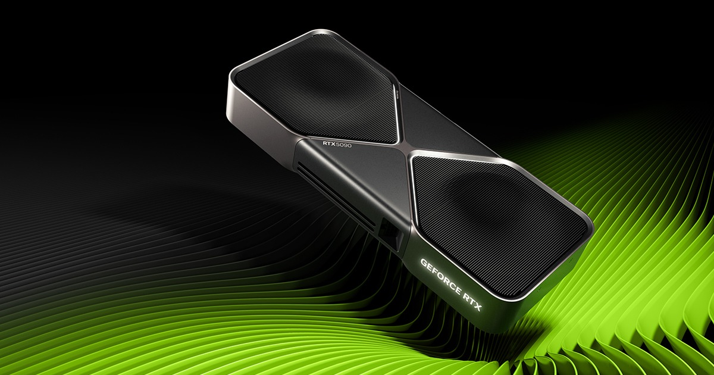
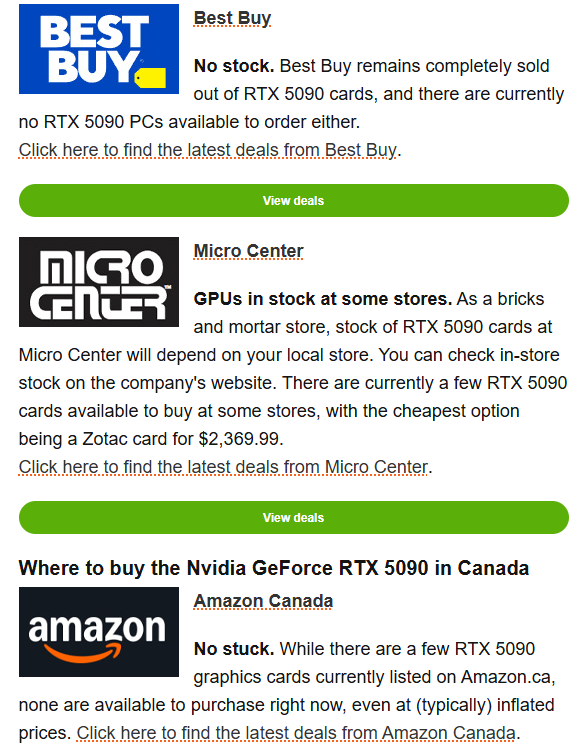
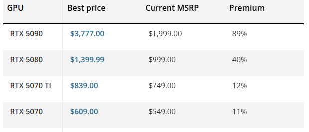
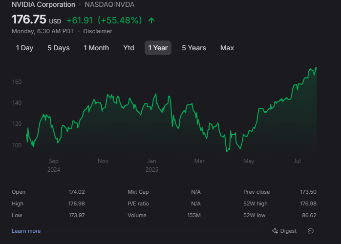

<head>
  <link rel="stylesheet" href="styles.css">
</head>

# Monopolies

- Last lecture we went through the best case scenario - perfect competition

- This lecture, we go through the worst case scenario of imperfect competition - monopolies!

# Monopolies

- Monopolies are basically the worst case scenario in economics

- All of supply is from one firm - this gives it the **power** to set the price, rather than be at the mercy of competition

- A tell-tale sign of monopolies in the real world:

↬ Prices are much higher than recommended retail prices

↬ Restricted supply - that is, making more money from selling less!

# Nvidia

Nvidia is an American company that makes a majority of chips used by the AI and machine learning industry

# Nvidia

Nvidia enjoys pretty close to a monopoly for chips used by AI:

> - Not because of chip making - most of its chips are made by a third-party TSMC

> - But because of the software that runs on it

> - Nvidia make a software, CUDA, that interfaces with large AI models and can only be run on Nvidia chips

> - Practically this means that Nvidia has a monopoly on selling chips to AI companies

# Nvdia

This monopoly is at odds with techno-optimists view of the world:

> - They say that AI will be ubiquitous and an integral part of every computer

# Nvidia

It is actually quite difficult to buy a new GPU:

# Nvidia

And if you do, you will probably pay much more than recommended retail price

# Nvidia

Despite selling fewer chips than they could, Nvidia profits are doing just fine!

# So what do we learn from Nvidia

- Nvidia essentially has monopoly power over supplying chips for AI

- We see the prices in the market are far above recommended retail price

- And, despite selling fewer chips 

This comes from Nvidia's monopoly power to sell its particular chips, allowing it to raise prices above its marginal cost of production

In a more competitive market, a business generally becomes less profitable when it sells less than it possibly could

# So what do we learn from Nvidia

This shows an economic **trade-off**. Nvidia raising its prices:

- Means it will sell fewer chips - losing sales but decreasing costs

- But it will make more profit on the chips that it does sell

We are going to explore how to optimally trade-off losing customers against making more profit on those that stick around

# Let's do a simple example with no calculus

The monopolist's goal is to maximize its profits by controlling the price

$\text{If demand is } Q_{D} = 100 - P \text{, and the firm has no costs, its profit is:}$
\begin{equation*}\begin{aligned}
	\pi = P (100 - P)
\end{aligned}\end{equation*}

Let's find what happens at a bunch of different prices!
