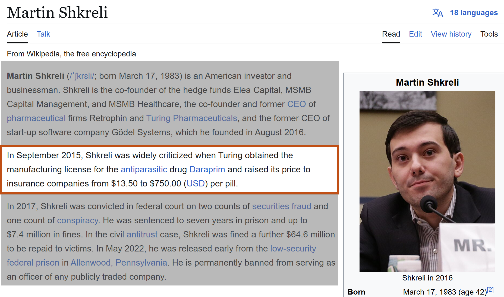

<head>
  <link rel="stylesheet" href="styles.css">
</head>

# Monopolies: Let's bring the customer into it

- We've been thinking a lot about welfare implications of monopolies and drilling into how monopoly firms behave

- But there's the other side of the equation:

**How do customer behaviours affect monopoly power**

# Monopolies: Let's bring the customer into it

> - Imagine you're a pharmaceutical company that makes a life saving drug that only you make

> - You have 100 customers that will pay anything to get this drug to keep on living

> - No matter how high you raise your prices, they will keep demanding

> - How high should the monopolist raise their prices?

# Monopolies: Let's bring the customer into it



# Monopolies: Let's bring the customer into it

We know our monopolists trade-off - but if customers don't respond to prices, it's not a trade-off!

The trade-off for raising prices is that:

- ~~Means it will sell fewer life-saving drugs - losing sales but decreasing costs~~

- But it will make more profit on the life-saving drugs that it does sell

The monopolist should raise prices to infinity if the customer will always buy!

# What if customers are super price sensitive?

> - You own a movie theatre and have a monopoly over food and drink sold there

> - But your customers are wily, the moment your prices go above marginal costs, they will revolt and smuggle in their own snacks and not buy any of yours

> - Can you exert your market power?

# What if customers are super price sensitive?

If our customers are super sensitive to price - we'll lose money from trying to raise prices

The trade-off for raising prices is that:

- Means it will sell no more snacks - they will be smuggled in

- ~~But it will make more profit on the snacks that it does sell~~

You power as a monopolist is useless if customers will no longer buy for a slightly higher price!

# Let's formalize this 

Recall from 100A, or learn very quickly, that the price elasticity of demand is the percentage drop in demand from a 1% increase in price:

\begin{equation*}\begin{aligned}
    \varepsilon_{D} = \frac{\% \text{ Change in quantity}}{\% \text{ Change in Price}} = \frac{\partial Q}{\partial P}\frac{P}{Q}
\end{aligned}\end{equation*}

The elasticity is negative, because an **increase** in price leads to a **decrease** in quantity demanded


# Let's formalize this 

The more negative the elasticity, the more sensitive to price the customer is:

- $\varepsilon = 0\quad\quad$ The customer is perfectly inelastic, no change in demand from a change in price (our life-saving drug example)
- $-1<\varepsilon < 0\quad$  The customer is inelastic, a change in price leads to a relatively smaller change in demand
- $-\infty<\varepsilon < -1\quad\quad$  The customer is elastic, a change in price leads to a relatively large change in demand
- $\varepsilon = -\infty\quad\quad$  The customer is perfectly elastic, even a small increase in price completely removes all demand

The monopolist's ability to raise prices above marginal costs depends on the customer's price elasticity

# Finding the elasticity for linear demand

When demand is **linear**, the elasticity will change with quantity/price - customers are more inelastic at lower prices

Example:

\begin{equation*}\begin{aligned}
    Q = 100 - P
\end{aligned}\end{equation*}

\begin{equation*}\begin{aligned}
    \varepsilon_{D} = \frac{dQ}{dP}\frac{P}{Q} = -1 \times \frac{P}{100 - P}
\end{aligned}\end{equation*}

- When $P = 10, \quad \varepsilon_{D} = -1 \times \frac{10}{90} = -0.11$ 
- When $P = 50, \quad \varepsilon_{D} = -1 \times \frac{50}{50} = -1$
- When $P = 90, \quad \varepsilon_{D} = -1 \times \frac{90}{10} = -9$

**Note:** This should make sense, a 1\% change in price at \$90 is \$0.9, which should move demand a lot; but a 1\% change at \$10 is only \$0.1 and should not affect demand that much


# The monopolist will also price until the elastic region of demand

In the inelastic region of demand (low prices)

- Raising prices leads to a proportionally smaller decrease in quantity demanded
- The profits gained from higher margins > profits lost from fewer sales
- **Result:** Total profits increase → Keep raising prices

In the elastic region of demand (higher prices)

- Raising prices leads to a proportionally larger decrease in quantity demanded
- The profits gained from higher margins < profits lost from fewer sales
- **Result:** Total profits start to decrease → Stop raising prices

Exactly where in the elastic region the monopoly stops will demand on the interactions of demand and cost

# Example:

Say the monopolist has zero costs and demand is:

\begin{equation*}\begin{aligned}
    Q = 100 - P
\end{aligned}\end{equation*}

In the low price region:

- Price goes from \$10 to \$11

- Quantity goes from 90 to 89

- Monopolist loses \$10 of revenue from losing customers, but makes \$89 of revenue on the customers that stay

- The monopolist should definitely make this price increase!


# Example:

Say the monopolist has zero costs and demand is:

\begin{equation*}\begin{aligned}
    Q = 100 - P
\end{aligned}\end{equation*}

In the high price price region:

- Price goes from \$90 to \$91

- Quantity goes from 10 to 9

- Monopolist loses \$90 of revenue from losing customers, but makes only \$9 of revenue on the customers that stay

- The monopolist is worse off from making that price increase


# Price markups depend on elasticity

We saw in our early examples that the less sensitive to price customers are, the more the monopolist could mark up prices

In general, there's a formula linking elasticity to price compared to marginal cost:

\begin{equation*}\begin{aligned}
    P = MC \times \frac{1}{1 + \frac{1}{\varepsilon}}
\end{aligned}\end{equation*}

# Price markups depend on elasticity

Let's do some examples

Let a monopolist have a constant marginal cost of \$10

If we know the elasticity of demand is -1.22, let's find price


\begin{equation*}\begin{aligned}
    P = MC \times \frac{1}{1 + \frac{1}{\varepsilon}}
\end{aligned}\end{equation*}


# Let's see this geometrically

The following are two different customer groups with different elasticities demands

But they will demand the same quantity from the monopolist

```{r echo=FALSE,warning=FALSE,error=FALSE,message=FALSE,cache=FALSE}
    library(tidyverse)
ggplot(
    data = tibble(
        quantity = seq(from = 0, to = 8, by = 0.1)
    ) |>
    mutate(
        price = 8 - quantity,
        marginal_revenue = 8 - 2 * quantity,
        type = "Relatively elastic"
    ) |>
    bind_rows(
        tibble(
        quantity = seq(from = 0, to = 14, by = 0.1)
    ) |>
    mutate(
        price = 14 - 2 * quantity,
        marginal_revenue = 14 - 4 * quantity,
        type = "Relatively inelastic"
    )
    ) |>
    filter(price >= 0) |>
    mutate(marginal_revenue = if_else(marginal_revenue < 0, NA_real_, marginal_revenue))
) +
facet_wrap(~type, nrow = 1) +
geom_hline(yintercept = 3, col = "darkred", linewidth = 1.4) +
geom_line(
    aes(x = quantity, y = price), col = "darkblue",
    linewidth = 1.4
) +
geom_line(
    aes(x = quantity, y = marginal_revenue), col = "darkblue",
    linewidth = 1.4, linetype = 2
) +
theme_minimal() +
labs(x = "Quantity", y = "Price")
    
```

