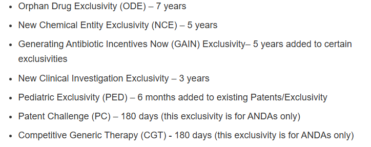
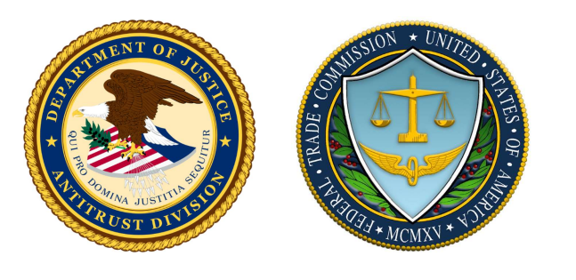

<head>
  <link rel="stylesheet" href="styles.css">
</head>

# Artificial monopolies 

We've been pretty hard on monopolies so far because they decrease welfare compared to a competitive market

But if we look around us, the government often uses policy to artificially create monopolies

**Are there some circumstances where we would prefer to have a monopoly over competition?**

# Drug discovery costs a lot of money

Discoverying new pharmaceutical costs a lot of money and is subject to many failures

> - The average cost to develop a new pharmaceutical drug and get it to market between 2000-2018 was \$172 million

> - There is about a 4:1 failure rate - for ever one drug that makes it to market, 4 fail

> - This means that every drug needs to make **at least** \$878 million to turn a profit

> - So why does any pharmaceutical business exist?

# Pharmaceuticals are covered by a period of exclusivity

- Depending on the type of drug, the developer gets the legal right to act like a monopoly for a certain period

- This provides the incentive for pharma companies to spend so much on new drug research

- Otherwise, other companies that haven't done the R&D work can essentially copy the drug for no upfront cost

- How do we think about this as policy makers?

# How do we think about this as policy makers?

> - Typically we think that monopolies are bad, because they create deadweight loss in the economy

> - But if it incentivises firms to make new products, then we should perhaps allow it

> - If the pharma company would not make the investment for a new pharmaceutical in a competitive market, then we are better off allowing a monopoly

> - If the pharma company **would** make the investment for a new pharmaceutical in a competitive market, then we should not allow the company to have monopoly power

# How do we think about this as policy makers?

We would prefer a **competitive market** to a **monopoly**

We would prefer a **monopoly** to **no market at all**

# Example of drug investment

A pharmaceutical company makes and investment of \$100 million to get a new drug to market. If it does not expect to recover at least that much in producer surplus/profit, it will not make the investment.

The total cost of supplying the drug to market is $TC = Q + Q^{2}$

Demand for the drug is $Q_{D} = 10,000 - 0.1 P$

If the company operates in a competitive market, it will capture 10\% of the total producer surplus. If it operates in a monopoly, it will capture 100\% of the surplus

**Should we allow it to be a monopoly?**

# Example of drug investment

**First, let's find the company's profit in a competitive market**

The marginal cost is $MC = \frac{d TC}{d Q} = 1 + 2 Q$

The demand curve can be written as inverse demand: $P = 100,000 - 10Q_{D}$

In a competitive market, $P = MC$:

\begin{equation*}\begin{aligned}
    &1 + 2Q = 100,000 - 10Q\\
    &12Q = 99,9999\\
    &Q = 8,333\\
\end{aligned}\end{equation*}
So the total competitive market will sell 8,333 units of the drug

The price will be: $P = MC = 1 + 2Q = 16,667$

The profit of the total market will be:
\begin{equation*}\begin{aligned}
    \pi = P\times Q - TC = 16,667 \times 8,333 - (8,333 + 8,333^{2}) = \sim\$69\text{ million}
\end{aligned}\end{equation*} 

The original company will only get a 10\% share of this profit of \$6.9 million, less than the original investment of \$100 million. So it will not create the drug

# Example of drug investment

**Now let's find the company's profit if it has a period of exclusivity**

The profit function is:
\begin{equation*}\begin{aligned}
    \pi &= P \times Q - (Q + Q^{2})\\
    &= P \times (10,000 - 0.1P) -(10,000 - 0.1P) - (10,000 - 0.1P)^{2}\\
\end{aligned}\end{equation*}

Find the price that maximizes profit:
\begin{equation*}\begin{aligned}
    \frac{d\pi}{d P} = &(10,000 - 0.1P) - 0.1P + 0.1 + 2 \times 0.1 \times (10,000 - 0.1P) = 0\\
    &10,000 + 0.1 + 2,000 - 0.1P - 0.1 P - 0.02P = 0\\
    &-0.2P = -12,000.1\\
    &P = 54,545\\
\end{aligned}\end{equation*}

So the monopoly price is much higher!

The pharma company will sell:
\begin{equation*}\begin{aligned}
    Q = 10,000 - 0.1P = 10,000 - 5,454 = 4,545
\end{aligned}\end{equation*}

The pharma company's total profit is:
\begin{equation*}\begin{aligned}
    \pi &= 54,545 \times 4,545 - 4,545 - 4,545^{2}\\
    &= \sim\$227\text{ million}
\end{aligned}\end{equation*}

So if the company gets exclusive rights, it earns enough profit to cover its investment

# What should we take away from this?

From a policy perspective, there are sometimes when it's preferable to have a monopoly

- We should not want a monopoly if we could sustain a competitive market

- If our choice is between a monopoly and no market at all - we're still better off with a monopoly! (Total surplus under no market is always 0)

In general, for it to be better to have a monopoly, there needs to be sufficiently high costs of entry where to encourage the firm to enter

# What should we take away from this?

- In the USA, it's the job of the Federal Trade Commission to analyze whether increasing market power in industries can be socially beneficial or not

- Sometimes mergers between firms can increase market power, but decrease the fixed costs of operating so that, on net, society is better off

- The Patent Office also exists to allow firms to claim exclusivity over novel inventions - ideally incentivizing innovation

# Other policies out there?

We don't always have to allow companies with large investment costs to act as monopolies

Other options exist and are used in parallel:

- Subsidising research costs

- Government guaranteeing minimum price and quantities (COVID vaccines)

- Nationalisation

# Natural monopolies and regulation

- The other place we might prefer monopolies is when it saves duplicated fixed costs

- If every competitor has to spend the same start up/fixed cost/investment cost, we might prefer to have just one monopoly

- We call these **natural monopolies**

# Natural monopolies and regulation

The electricity grid has an unusual cost profile:

- It has really, really high fixed costs to initially build the network

- But the marginal cost of serving customers once it's built is really low - ie, marginal costs are low

This is an example of a **natural monopoly** - to compete with the power grid, a competitor would have to waste billions of dollars replicating the entire grid

- It's socially beneficial to just operate one grid (saves the costs of building competitor grids)

# Natural monopolies and regulation

- The barriers of entry of a natural monopoly differ to that of a drug company

- With a natural monopoly, any competitor would have to duplicate the entire fixed cost of entering the market

$\quad\quad\quad$ - Example: a competitor to PGE would have to build an entirely new electricity grid

$\quad\quad\quad$ - Will be better for society to just have one grid to save the cost   

- With the pharmaceutical industry - competitors could easily copy the new drug once the research has been done

$\quad\quad\quad$ - Competitors don't have to duplicate the fixed cost so we might allow competition

$\quad\quad\quad$ - Other example: Once someone has written a book (large fixed cost), it's very easy to copy it. We don't allow this under copyright law!

# Natural monopolies and regulation

When natural monopolies exist, the government is keen to regulate them:

- Power grids

- Railway networks

- Gas pipelines

- Internet backbone networks

We should think of regulation as useful when we could not sustain a competitive market because of high barriers to entry. There are a lot of jobs for government and consulting economists that regulate/fight regulation large companies

# Natural monopolies and regulation

How does the government regulate the electricity grid operator PGE? If it was not regulated, it would charge monopoly prices!

> - In California, the California Public Utilities Commission sets a maximum price that PGE can charge

> - The price is supposed to reflect the profit PGE would make if they invested their money into a more competitive infrastructure project

> - It keeps the balance where PGE makes a profit (keeping PGE happy), but it is far below monopoly profit (keeping customers happy)

> - CPUC also regulated service standards so PGE does not diminish its service quality
