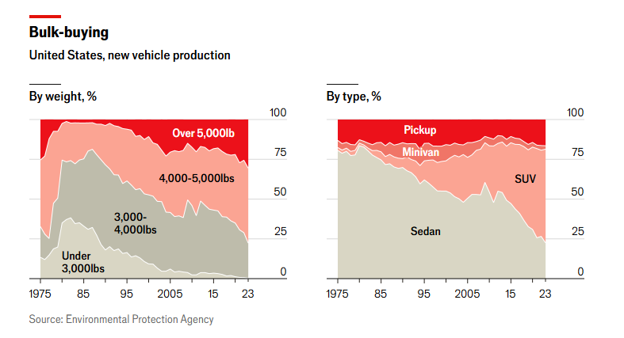
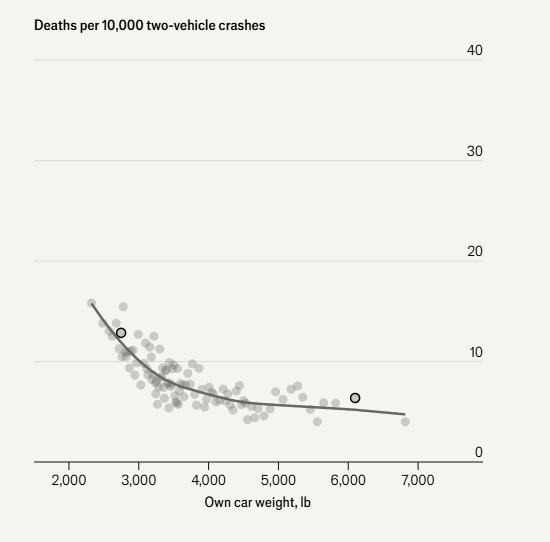
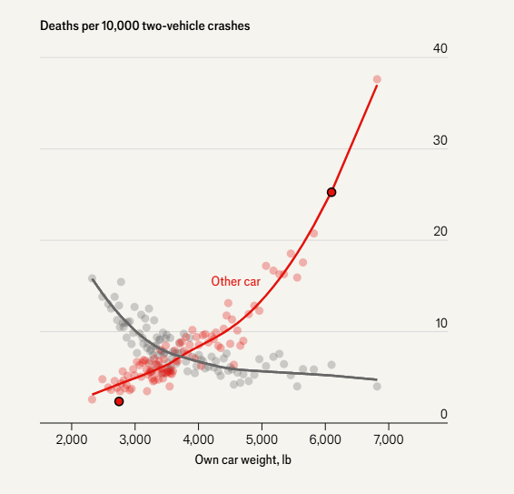
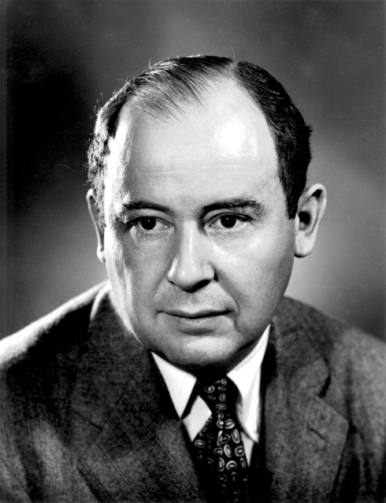

<head>
  <link rel="stylesheet" href="styles.css">
</head>

# American cars are getting bigger and bigger

The following is a story from the Economist available [here](https://www.economist.com/interactive/united-states/2024/08/31/americans-love-affair-with-big-cars-is-killing-them)

The cars that Americans are buying are getting heavier and heavier

# There is a rational thought here

Generally speaking, if you're in a heavier car, you're less likely to die if you're in a crash

# But this makes everyone else less safe

But if you're in a heavy car, you're much more likely to kill someone if you're in an accident

If you have a Ford F350, the probability that someone in the other car dies is 35\%, compared to 5\% if you're in a Honda Civic

# Let's follow the trail of incentives

We have a situation where people are responding to each other's behaviours:

> - If Anna and Beth have small cars, they are both quite safe

> - Anna thinks they will be more safe with a bigger car, so they buy a bigger car. 

> - This makes Beth incredibly unsafe in their small car!

> - So Beth buys a big car too! 

> - Now Anna and Beth both have a big car but are more unsafe than when they both had small cars!

**Key point:** Anna and Beth's decisions are influenced by one another's

# Prisoner's dilemma

This is an example of what we call a `Prisoner's dilemma' (you'll see why in discussion)

Both Anna and Beth are less safe both having big cars, but they both got there through rational decisions

We're going to introduce some concepts in `game theory' to explain this

# Car safety and game theory

<table style="border-collapse: collapse;">
  <tr>
    <td style="border-right: 3px solid black; border-bottom: 3px solid black; padding: 30px;"></td>
    <td style="border-right: 1px solid black; border-bottom: 3px solid black; padding: 30px;">Anna buys a small car</td>
    <td style="border-bottom: 3px solid black; padding: 30px;">Anna buys a big car</td>
  </tr>
  <tr>
    <td style="border-right: 3px solid black; border-bottom: 1px solid black; padding: 30px;">Beth buys a small car</td>
    <td style="border-right: 1px solid black; border-bottom: 1px solid black; padding: 30px;">Anna 10% probability of dying   Beth 10% probability of dying</td>
    <td style="border-bottom: 1px solid black; padding: 30px;">A: 5%   B: 30% </td>
  </tr>
  <tr>
    <td style="border-right: 3px solid black; padding: 30px;">Beth buys a big car car</td>
    <td style="border-right: 1px solid black; padding: 30px;">A: 30%   B: 5% </td>
    <td style="padding: 30px;">A: 15%  B: 15%</td>
  </tr>
</table>

The above is a **payoff matrix**. It shows the decisions of both Anna and Beth, and their `payoffs' - their probability of dying if they're in a crash

# Car safety and game theory

<table style="border-collapse: collapse;">
  <tr>
    <td style="border-right: 3px solid black; border-bottom: 3px solid black; padding: 30px;"></td>
    <td style="border-right: 1px solid black; border-bottom: 3px solid black; padding: 30px;">Anna buys a small car</td>
    <td style="border-bottom: 3px solid black; padding: 30px;">Anna buys a big car</td>
  </tr>
  <tr>
    <td style="border-right: 3px solid black; border-bottom: 1px solid black; padding: 30px;">Beth buys a small car</td>
    <td style="border-right: 1px solid black; border-bottom: 1px solid black; padding: 30px;">Anna 10% probability of dying   Beth 10% probability of dying</td>
    <td style="border-bottom: 1px solid black; padding: 30px;">A: 5%   B: 30% </td>
  </tr>
  <tr>
    <td style="border-right: 3px solid black; padding: 30px;">Beth buys a big car car</td>
    <td style="border-right: 1px solid black; padding: 30px;">A: 30%   B: 5% </td>
    <td style="padding: 30px;">A: 15%  B: 15%</td>
  </tr>
</table>

From our story, we ended up where both Anna and Beth bought big cars. But they both would have been safer with small cars. How did we end up here?

# Car safety and game theory

<table style="border-collapse: collapse;">
  <tr>
    <td style="border-right: 3px solid black; border-bottom: 3px solid black; padding: 30px;"></td>
    <td style="border-right: 1px solid black; border-bottom: 3px solid black; padding: 30px;">Anna buys a small car</td>
    <td style="border-bottom: 3px solid black; padding: 30px;">Anna buys a big car</td>
  </tr>
  <tr>
    <td style="border-right: 3px solid black; border-bottom: 1px solid black; padding: 30px;">Beth buys a small car</td>
    <td style="border-right: 1px solid black; border-bottom: 1px solid black; padding: 30px;">Anna 10% probability of dying   Beth 10% probability of dying</td>
    <td style="border-bottom: 1px solid black; padding: 30px;">A: 5%   B: 30% </td>
  </tr>
  <tr>
    <td style="border-right: 3px solid black; padding: 30px;">Beth buys a big car car</td>
    <td style="border-right: 1px solid black; padding: 30px;">A: 30%   B: 5% </td>
    <td style="padding: 30px;">A: 15%  B: 15%</td>
  </tr>
</table>

What we have showed is that both buying big cars is a **Nash Equilibrium** - keeping the other player's decisions the same, no one would want to deviate from this

If Anna has a big car, Beth prefers having a big car over a small car

If Anna has a small car, Beth still prefers having a big car over a small car

# Nash Equilibria in games

> - We setup our games that players choose decisions at the same time, without knowing what the other person chooses

> - After the game is played:

$\quad\quad\quad$ - If anyone regrets their action, would prefer to have 'deviated', then we don't have an equilibrium

$\quad\quad\quad$ - If no one regrets their action, we call this a **Nash Equilibrium**

# Nash Equilibria in games

- We should think of finding Nash equilibria like finding the optimal point in our profit function

- There is no other action I could take that would make me better off **keeping everyone else's decisions the same**

- **Of course** this is harder than, say, finding the optimal price as a monopolist, because other people are making decisions too

- Evolving this skill of thinking about Nash equilibria is going to help us think about a small number of firms competing with each other

# Nash Equilibria in games

> - Every game has at least one Nash Equilibrium, some games will have multiple equilibria

> - Sometimes that equilibrium will require players make decisions with some degree of randomness

> - When a Nash equilibrium has no randomisation, we call it a pure strategy equilibrium

> - When a Nash equilibrium requires randomisation, we call it a mixed strategy equilibrium

> - The Nash Equilibria is not always the **socially optimal** outcome - we would prefer everyone to have smaller cars, but we end up with big ones

# A lot of game theory was developed post WWII thinking about nuclear proliferation

- John von Neumann was an absolute legend

- Worked as a physicist on the Manhattan Project

- Helped create the first computers. All modern computers still use the same architecture he pioneered

- Developed the ground work of game theory in the wake of WWII

$\quad\quad\quad$ - Many people were thinking about whether nuclear weapon proliferation would lead to peace or war

$\quad\quad\quad$ - von Neumann, among others, studied this with game theory

$\quad\quad\quad$ - The problem was it was difficult to work out if games had natural equilibria and what they were - so would policy lead to peace or war?

# Enter John Nash

- At 22, wrote a 28 page PhD dissertation showing that all games that we'll consider have equilibria (jealous)

- His math is far more complicated than anything we'll look at, but gives us the general idea:

**Any game we look at, will have at least one equilibrium point**

# Let's see how we could solve to find Nash equilibria

<table style="border-collapse: collapse;">
  <tr>
    <td style="border-right: 3px solid black; border-bottom: 3px solid black; padding: 30px;"></td>
    <td style="border-right: 1px solid black; border-bottom: 3px solid black; padding: 30px;">Firm 1 charges a high price</td>
    <td style="border-bottom: 3px solid black; padding: 30px;">Firm 1 charges a low price</td>
  </tr>
  <tr>
    <td style="border-right: 3px solid black; border-bottom: 1px solid black; padding: 30px;">Firm 2 charges a high price</td>
    <td style="border-right: 1px solid black; border-bottom: 1px solid black; padding: 30px;">F1 gets 10   F2 gets 10</td>
    <td style="border-bottom: 1px solid black; padding: 30px;">F1 gets 12   F2 gets 0</td>
  </tr>
  <tr>
    <td style="border-right: 3px solid black; padding: 30px;">Firm 2 charges a low price</td>
    <td style="border-right: 1px solid black; padding: 30px;">F1 gets 0   F2 gets 12 </td>
    <td style="padding: 30px;">F1 gets 8   F2 gets 8</td>
  </tr>
</table>

# The kit kats are back

I need two people to play Share or Steal

- There are six kit kats on offer

- Players can choose to play share or steal

- If both play share, they split the loot 50-50

- If one shares and one steals, the stealer gets it all

- If both steal - both get nothing!

# Share or steal

Let's work through the Nash Equilibria here

<table style="border-collapse: collapse;">
  <tr>
    <td style="border-right: 3px solid black; border-bottom: 3px solid black; padding: 30px;"></td>
    <td style="border-right: 1px solid black; border-bottom: 3px solid black; padding: 30px;">Person 1 plays Share</td>
    <td style="border-bottom: 3px solid black; padding: 30px;">Person 1 plays Steal</td>
  </tr>
  <tr>
    <td style="border-right: 3px solid black; border-bottom: 1px solid black; padding: 30px;">Person 2 plays Share</td>
    <td style="border-right: 1px solid black; border-bottom: 1px solid black; padding: 30px;">P1 gets 3   P2 gets 3</td>
    <td style="border-bottom: 1px solid black; padding: 30px;">P1 gets 6   P2 gets 0</td>
  </tr>
  <tr>
    <td style="border-right: 3px solid black; padding: 30px;">Person 2 plays Steal</td>
    <td style="border-right: 1px solid black; padding: 30px;">P1 gets 0   P2 gets 6 </td>
    <td style="padding: 30px;">P1 gets 0   P2 gets 0</td>
  </tr>
</table>

# Sometimes there might be multiple Nash equilibrium

<table style="border-collapse: collapse;">
  <tr>
    <td style="border-right: 3px solid black; border-bottom: 3px solid black; padding: 30px;"></td>
    <td style="border-right: 1px solid black; border-bottom: 3px solid black; padding: 30px;">Anna buys a small car</td>
    <td style="border-bottom: 3px solid black; padding: 30px;">Anna buys a big car</td>
  </tr>
  <tr>
    <td style="border-right: 3px solid black; border-bottom: 1px solid black; padding: 30px;">Beth buys a small car</td>
    <td style="border-right: 1px solid black; border-bottom: 1px solid black; padding: 30px;">Anna 10% probability of dying   Beth 10% probability of dying</td>
    <td style="border-bottom: 1px solid black; padding: 30px;">A: 12%   B: 30% </td>
  </tr>
  <tr>
    <td style="border-right: 3px solid black; padding: 30px;">Beth buys a big car car</td>
    <td style="border-right: 1px solid black; padding: 30px;">A: 30%   B: 12% </td>
    <td style="padding: 30px;">A: 15%  B: 15%</td>
  </tr>
</table>

Slightly changing the probabilities now means that both buying small cars, or both buying big cars are an equilibrium

